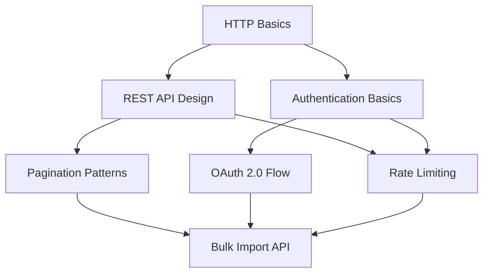

# Chapter 1: Knowledge Graph Foundations

## Learning Objectives

By the end of this chapter, you will be able to:

- Explain what a knowledge graph is and why it outperforms flat document stores for training content
- Model a domain as nodes, edges, and properties using a directed acyclic graph (DAG) structure
- Identify the entities and relationships in your own content domain
- Design a schema that captures concept dependencies for downstream content generation
- Distinguish between a knowledge graph and a taxonomy, ontology, or tag system

---

## Why Content Systems Break

Most training programs start with a shared drive and a naming convention. Someone writes the product overview. Someone else writes the feature guide. A third person writes the quickstart. Six months later, a product update changes a core workflow, and no one knows which documents reference the old behavior.

This is not a documentation problem. It is an architecture problem.

The content was authored as isolated artifacts — each document a self-contained unit with its own internal logic, written at a point in time, with no machine-readable connection to the concepts it describes. When the underlying facts change, there is no way to identify the impact. You can search for keywords and hope, or you can read every document manually.

Knowledge graphs solve this by inverting the relationship between facts and documents. Instead of storing facts inside documents, you store facts in a structured graph and generate documents from that graph. The graph becomes the source of truth. Documents become derived outputs.

---

## What Is a Knowledge Graph?

A knowledge graph is a network of entities (nodes) connected by typed relationships (edges). Each node represents a concept, object, process, or fact. Each edge represents a named relationship between two nodes. Both nodes and edges can carry properties — key-value pairs that store additional attributes.

The simplest possible example:

```
[Feature: API Rate Limiting] --APPLIES_TO--> [Product: Developer API]
[Feature: API Rate Limiting] --CONFIGURED_VIA--> [Setting: Rate Limit Tier]
[Setting: Rate Limit Tier] --HAS_VALUES--> [Value: Free | Pro | Enterprise]
[Feature: API Rate Limiting] --EXPLAINED_IN--> [Document: API Reference, Section 4.2]
```

This graph captures four facts about API rate limiting. When the rate limit tiers change (Free is discontinued, a Growth tier is added), you update two nodes and one edge. Every document that references rate limit tiers can be automatically flagged for review or regenerated.

In a flat document store, you would need to search for every document that mentions "Free tier" or "rate limit" and manually assess whether each one needs updating.

---

## Nodes: What Gets Modeled

The entities in a content knowledge graph fall into a small number of categories:

**Concepts** — Named ideas that learners need to understand. Examples: "idempotency," "webhook retry logic," "role-based access control." Concepts have definitions, prerequisites, and related concepts.

**Procedures** — Sequences of steps that produce a specific outcome. Examples: "configure SSO," "submit a support ticket," "export a dataset." Procedures have preconditions, steps, and expected results.

**Products and Features** — The actual things described in your content. Examples: "Reporting Dashboard," "Bulk Import API," "Custom Fields." These are the subjects your content is about.

**Roles** — The audiences who need specific knowledge. Examples: "System Administrator," "End User," "Sales Engineer," "Integration Developer." Roles connect to the concepts and procedures they need to understand.

**Outcomes** — The goals that motivate learning. Examples: "successfully onboard a new customer," "configure a compliant deployment," "pass the partner certification exam." Outcomes tie together the concepts and procedures needed to achieve them.

**Sources** — The authoritative documents, specs, changelogs, and data sheets from which facts are derived. Sources give every node a provenance trail.

---

## Edges: How Relationships Are Typed

Edges in a content knowledge graph are named and directional. The names are chosen to be unambiguous and to read naturally in both directions.

| Edge Type | Direction | Meaning |
|-----------|-----------|---------|
| `PREREQUISITE_OF` | Concept A → Concept B | Must understand A before B |
| `PART_OF` | Feature A → Product B | Feature belongs to product |
| `REQUIRED_FOR` | Concept A → Outcome B | Needed to achieve the outcome |
| `PERFORMED_BY` | Procedure A → Role B | This role performs this procedure |
| `DESCRIBED_IN` | Concept A → Source B | Fact sourced from document |
| `SUPERSEDES` | Version A → Version B | A replaces B (temporal) |
| `CONTRADICTS` | Claim A → Claim B | Used in validation (should never persist) |
| `VARIANT_OF` | Content A → Content B | Same content, different audience |

The `PREREQUISITE_OF` edge is particularly important. It defines the dependency structure of your content — what learners need to know before they can understand a new concept. This is the basis for sequencing chapters, generating learning paths, and detecting gaps.

---

## The DAG Structure

A directed acyclic graph (DAG) is a graph where edges have direction and there are no cycles — you cannot follow edges from a node back to itself. This constraint is important for content architecture.

Concept dependencies must be a DAG. If Concept A requires Concept B and Concept B requires Concept A, you have a circular dependency that cannot be taught in a linear sequence. The DAG constraint forces you to resolve this by either splitting one concept or identifying the shared foundation that both depend on.



In this DAG, "Bulk Import API" depends on Pagination Patterns, OAuth 2.0 Flow, and Rate Limiting — which in turn each depend on more foundational concepts. This structure tells a content generation system exactly what to cover, in what order, before introducing Bulk Import API.

---

## Knowledge Graph vs. Related Concepts

Content practitioners often confuse knowledge graphs with other structural approaches. The distinctions matter:

**Taxonomy**: A hierarchical classification system (tree structure). A taxonomy tells you that a concept belongs to a category. It does not capture how concepts relate to each other laterally or describe their dependencies. A taxonomy is a subset of what a knowledge graph can represent.

**Ontology**: A formal specification of concepts and relationships within a domain, often using description logic (OWL, RDF). Ontologies are powerful but require significant upfront formalization. For most content teams, a well-typed property graph achieves 90% of the value with 10% of the overhead.

**Tag system**: A flat labeling mechanism. Tags group content by shared attributes but do not capture structure or relationships. Tags are good for filtering; knowledge graphs are good for reasoning.

**Relational database**: Tables with foreign keys can represent graphs, but query complexity grows rapidly for multi-hop traversals. Graph databases (Neo4j, Amazon Neptune) and in-memory graph libraries (NetworkX, Graphlib) are purpose-built for the traversal patterns that content operations require.

---

## Implementation Patterns

### Option 1: Structured YAML/JSON (Entry Level)

For teams starting out, a structured YAML or JSON representation works well. It requires no infrastructure and integrates easily with docs-as-code workflows.

```yaml
concepts:
  - id: rate-limiting
    label: "API Rate Limiting"
    definition: "A mechanism that controls how many API requests a client can make in a given time window."
    prerequisites:
      - http-basics
      - authentication-basics
    applies_to:
      - product: developer-api
    role_relevance:
      - integration-developer
      - system-administrator
    source: "API Reference v3.2, Section 4.2"
    last_verified: "2025-11-01"
```

This format is version-controllable, diffable, and readable without specialized tooling. It can be parsed by Python scripts, fed into LLM prompts, and used to generate documentation.

### Option 2: Graph Database (Production Scale)

For content systems with hundreds of concepts across multiple products, a graph database like Neo4j provides:

- Cypher query language for complex traversals
- Native graph storage optimized for multi-hop queries
- Visualization tools for editorial review
- API access for integration with generation and QA pipelines

A typical Cypher query to find all concepts a new integration developer needs to understand before using the Bulk Import API:

```cypher
MATCH path = (c:Concept)-[:PREREQUISITE_OF*]->(target:Concept {id: "bulk-import-api"})
WHERE (c)-[:RELEVANT_FOR]->(:Role {name: "Integration Developer"})
RETURN c.label, length(path) as depth
ORDER BY depth ASC
```

### Option 3: In-Memory Graph Library (Prototyping and Scripts)

Python's `networkx` library is excellent for building prototype content graphs, running validation checks, and generating reports without standing up database infrastructure.

```python
import networkx as nx

G = nx.DiGraph()
G.add_node("rate-limiting", label="API Rate Limiting", type="concept")
G.add_node("http-basics", label="HTTP Basics", type="concept")
G.add_edge("http-basics", "rate-limiting", relationship="PREREQUISITE_OF")

# Find all prerequisites for a concept
prereqs = list(nx.ancestors(G, "rate-limiting"))
print(f"Prerequisites: {prereqs}")
```

---

## Building Your First Content Graph

The practical starting point is a domain entity extraction exercise. Take your three most complex training topics and work through these steps:

**Step 1: List all concepts** — What named ideas does a learner need to understand to master these topics? Write them as noun phrases.

**Step 2: Define dependencies** — For each concept, ask: "What must someone already understand before this concept makes sense?" These become `PREREQUISITE_OF` edges.

**Step 3: Identify roles** — Which learner personas need which concepts? A system administrator may need rate limiting concepts for a different reason than an integration developer. The relationship is not concept → role but rather outcome → (role × concept × procedure).

**Step 4: Attach sources** — For each concept, identify the authoritative source document. This is the fact provenance trail that enables drift detection later.

**Step 5: Validate the DAG structure** — Check for cycles. If you find one, it indicates a concept boundary problem. Split the concept or identify the shared primitive.

---

## Schema Design Principles

**Use stable identifiers** — Node IDs should be slugs (`rate-limiting`, not `Rate Limiting (API)`) that survive renaming. Display labels can change; IDs should not.

**Separate facts from presentation** — Store what is true, not how it should be formatted. The graph stores the fact that rate limiting applies to the Developer API. The rendering layer decides whether to express that as a callout box, a table row, or a sentence in a paragraph.

**Version concepts explicitly** — When a concept changes substantially, create a new node version and add a `SUPERSEDES` edge. Do not update nodes in place when backward compatibility matters.

**Design for traversal, not storage** — The schema should optimize for the queries your content operations need: "What needs updating when Feature X changes?" "What prerequisites are missing from this learning path?" These traversal patterns determine your edge types.

---

## Key Takeaways

- Knowledge graphs store facts as structured nodes and relationships, not as documents. Documents are derived outputs from the graph.
- The DAG structure of concept dependencies enables automated sequencing, gap detection, and impact analysis when content changes.
- Node types in a content graph include concepts, procedures, products/features, roles, outcomes, and sources.
- Typed edges (PREREQUISITE_OF, PART_OF, REQUIRED_FOR, DESCRIBED_IN) enable precise queries that flat search cannot replicate.
- Start with structured YAML or JSON; graduate to a graph database when traversal complexity and query volume justify the infrastructure.
- The graph schema should be designed around the operational queries your content team needs, not around theoretical completeness.

---

*Chapter 2: Modular Content Architecture — Designing content units that compose across audiences and formats without duplication.*
