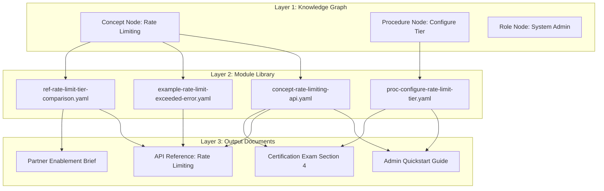

# Chapter 2: Modular Content Architecture

## Learning Objectives

By the end of this chapter, you will be able to:

- Distinguish between monolithic documents and modular content units
- Design atomic content components that compose into multiple output formats
- Identify the appropriate granularity for content modules in your domain
- Map the relationship between content modules, knowledge graph nodes, and audience outputs
- Build a reusable content module library with consistent metadata

---

## The Monolith Problem

The default mode for training content is the document. A document has a beginning, middle, and end. It was written for a specific audience, in a specific context, at a specific time. It works well as long as the audience, context, and content are stable.

When any of those variables changes, the document fails.

A product team adds a new user role. Now every guide that describes "the administrator" has a paragraph that applies to admins but not to the new role, and a gap where the new role's workflow should be. You rewrite the guide. Six months later, the product adds another role.

A feature changes its configuration workflow. The quickstart, the admin guide, the onboarding checklist, and the certification exam all describe the old workflow. Someone finds and updates the quickstart. The other three remain wrong for eight months.

These failures share a root cause: content is stored at document granularity when it should be stored at concept and procedure granularity. Documents are built for human reading; modules are built for composition.

---

## The Module vs. Monolith Distinction

A **monolithic document** embeds all facts, context, examples, and transitions inside a single artifact. It is optimized for linear reading by one audience. Every fact exists exactly once — inside that document — with no machine-readable identity.

A **content module** is an atomic unit of content with a unique identifier, typed content category, explicit audience and context metadata, and stable interfaces. It can be assembled with other modules into different outputs without rewriting.

| Dimension | Monolith | Module |
|-----------|----------|--------|
| Granularity | Document (pages) | Concept/procedure (paragraphs) |
| Identity | File path | Stable ID + version |
| Audience encoding | Implicit (written for one) | Explicit metadata |
| Reuse | Copy-paste | Composition via reference |
| Update impact | Unknown | Graph-traceable |
| Version tracking | File-level | Module-level |
| Generation target | Manual | Template + module = output |

The transition from monolith to module is not primarily a technical change. It is a structural discipline about where decisions live. In a modular system, the decision about what is true lives in the module. The decision about how to present it lives in the rendering layer.

---

## Module Types

Content modules fall into a small number of functional categories. The taxonomy should be specific enough to drive rendering decisions but simple enough for content authors to apply consistently.

### Concept Module

A **concept module** explains a named idea. It has a definition, context for why the concept matters, and connections to related concepts. Concept modules are the direct output of knowledge graph nodes.

```yaml
module_id: concept-rate-limiting-api
module_type: concept
title: "API Rate Limiting"
definition: >
  A mechanism that controls the number of API requests a client application
  can make within a defined time window, protecting service stability and
  ensuring fair resource allocation across consumers.
why_it_matters: >
  Rate limits determine what is possible within your API integration.
  Exceeding them triggers errors that must be handled gracefully;
  understanding tier limits is required for capacity planning.
prerequisites:
  - concept-http-request-response
  - concept-api-authentication
related_concepts:
  - concept-retry-logic
  - concept-api-pagination
audience_relevance:
  integration-developer: primary
  system-administrator: reference
  end-user: none
source_reference: "API Reference v3.2, Section 4.2"
last_verified: "2025-11-01"
```

### Procedure Module

A **procedure module** describes a sequence of steps to accomplish a specific task. It has preconditions, numbered steps, expected results, and error recovery notes.

```yaml
module_id: proc-configure-rate-limit-tier
module_type: procedure
title: "Configure Your Rate Limit Tier"
preconditions:
  - "Administrator account access"
  - "Active subscription (Pro or Enterprise)"
steps:
  - step: 1
    action: "Navigate to Settings > API Access"
    expected_result: "API Access settings panel opens"
  - step: 2
    action: "Select Rate Limit Tier from the dropdown"
    expected_result: "Current tier shown; options display available upgrades"
  - step: 3
    action: "Select the desired tier and click Save"
    expected_result: "Confirmation message; new limits take effect within 60 seconds"
error_recovery:
  - error: "Save button disabled"
    cause: "Insufficient account permissions"
    resolution: "Contact your account owner to request administrator access"
audience_relevance:
  system-administrator: primary
  integration-developer: secondary
```

### Reference Module

A **reference module** is a structured data presentation — a table, a parameter list, an error code catalog. It does not explain; it specifies. Reference modules are queried, not read linearly.

### Example Module

An **example module** is a concrete illustration of a concept or procedure in a specific context. Examples are the most audience-sensitive module type — the same concept needs different examples for a startup integrating an API and an enterprise admin configuring SAML SSO.

### Warning and Callout Module

**Warning modules** capture must-know exceptions, limitations, and safety information. They are composable into any output that includes the relevant concept or procedure.

---

## Granularity: How Fine Is Fine Enough?

Granularity is the most important decision in modular content design. Too coarse, and modules contain multiple facts that need to be separated for different audiences. Too fine, and modules require excessive assembly logic and lose readability.

The right granularity satisfies two tests:

**The single responsibility test**: Can this module be completely updated when one fact changes? If a module requires partial rewriting when different facts change, it needs to be split.

**The composition test**: Can this module appear in at least two different output contexts? If a module is only ever used in one place, it is granular but not modular.

Applying these tests to a common content pattern:

- "Authentication and rate limiting guide" — fails both tests (multiple responsibilities, single output)
- "API Authentication" (concept) — passes both tests
- "Rate Limiting" (concept) — passes both tests
- "The letter 'A' in API" — passes the single responsibility test, fails composition (too granular to be useful)

The practical target is procedure-level and concept-level granularity, typically ranging from 150 to 600 words per module for explanatory content.

---

## Module Metadata Schema

Consistent metadata is what makes modules composable. Without it, assembly is manual. With it, assembly can be automated.

Every module in a well-designed system carries:

```yaml
# Identity
module_id: string          # Stable slug, never changes
module_type: enum          # concept | procedure | reference | example | warning
version: semver            # 1.0.0 — patch for corrections, minor for additions, major for rewrites

# Content
title: string
body: markdown             # The content itself

# Relationships
prerequisites: [module_id]
related_modules: [module_id]
source_reference: string   # Provenance link to authoritative source

# Audience
audience_relevance:        # Map of role → relevance level
  role_id: primary|secondary|none

# Operational
last_verified: date
next_review: date
owner: string              # Team or person responsible
status: enum               # draft | review | approved | deprecated
```

This metadata schema enables automated assembly: given a role and an outcome, the system can query for all primary and secondary modules, sort them by prerequisite order (using the knowledge graph DAG), and assemble a coherent output.

---

## Content Composition Architecture

The relationship between knowledge graph nodes, content modules, and output documents follows a three-layer architecture:



Layer 1 defines what is true. Layer 2 stores the authored expression of those truths. Layer 3 assembles modules into audience-specific outputs.

When a fact changes in Layer 1, the affected modules in Layer 2 are identified through the graph, updated once, and all downstream outputs in Layer 3 are regenerated or flagged for review.

---

## Designing for Reuse

Reusable modules require clear interface contracts — agreement about what a module will and will not contain, so assembly logic can be written once.

**Write for context-independence** — A module should not assume it follows another specific module. Opening sentences like "As we discussed in the previous section" break when the module is reused in a different sequence.

**Externalize audience-specific framing** — The module body contains the universal fact. Audience-specific framing (tone, emphasis, example selection) is applied at render time by the audience adaptation layer, not baked into the module.

**Use stable cross-references** — When a module references another concept, reference it by `module_id`, not by title or URL. Titles change; IDs should not.

**Separate instructional scaffolding** — "By the end of this section, you will understand X" is instructional scaffolding, not content. Some output formats need it; others do not. Store scaffolding as optional metadata, not embedded text.

---

## Building a Module Library

A content module library is a structured collection of modules with:

- **Directory structure** organized by module type and domain
- **A module registry** (index file or database) that maps IDs to file paths and metadata
- **Validation tooling** that enforces schema compliance at commit time
- **Search and discovery** so authors can find existing modules before writing new ones

A minimal directory structure for a product documentation system:

```
modules/
  concepts/
    concept-api-authentication.yaml
    concept-rate-limiting-api.yaml
    concept-webhook-delivery.yaml
  procedures/
    proc-configure-rate-limit-tier.yaml
    proc-register-webhook-endpoint.yaml
  references/
    ref-error-codes.yaml
    ref-rate-limit-tiers.yaml
  examples/
    example-oauth-flow-nodejs.yaml
    example-rate-limit-exceeded-error.yaml
  warnings/
    warning-rate-limit-tier-downgrade.yaml
registry.yaml
```

The registry provides a queryable index:

```yaml
modules:
  - id: concept-rate-limiting-api
    type: concept
    path: concepts/concept-rate-limiting-api.yaml
    title: "API Rate Limiting"
    status: approved
    audience: [integration-developer, system-administrator]
    topics: [rate-limiting, api-access]
```

---

## Migrating from Monoliths

The migration from monolithic documents to modules is incremental. A full upfront rewrite of all content is unnecessary and counterproductive.

**Phase 1: Identify reuse candidates** — Audit existing documents for content that appears in multiple places (even if slightly reworded). These are the highest-priority candidates for extraction into modules.

**Phase 2: Extract and formalize** — Pull identified content into module files. Assign IDs, add metadata, validate against the schema. Replace the original content with a reference to the module ID.

**Phase 3: Audit monoliths for structure** — Review remaining monolithic documents and decompose them into concept + procedure + example modules. The original document becomes an output template that assembles modules for a specific audience.

**Phase 4: Enforce at authoring time** — Add module schema validation to the content review process. New content enters the system as modules, not documents.

---

## Key Takeaways

- Monolithic documents embed facts in artifacts, creating maintenance problems when content is updated or reused across audiences.
- Content modules are atomic units with typed categories, stable identifiers, and explicit audience metadata — the building blocks of composed outputs.
- The five core module types are: concept, procedure, reference, example, and warning. Each has a distinct purpose and authoring contract.
- Granularity is determined by two tests: single responsibility (one fact per module) and composition (used in at least two contexts).
- Module metadata — IDs, types, prerequisites, audience relevance, sources — is what enables automated assembly and impact analysis.
- The three-layer architecture (knowledge graph → module library → output documents) keeps facts, expression, and presentation cleanly separated.
- Migration from monoliths is incremental: identify reuse candidates first, extract and formalize, then enforce at authoring time.

---

*Chapter 3: AI-Augmented Content Generation — Using LLMs to generate training content from structured knowledge graph sources with consistent voice and accuracy.*
