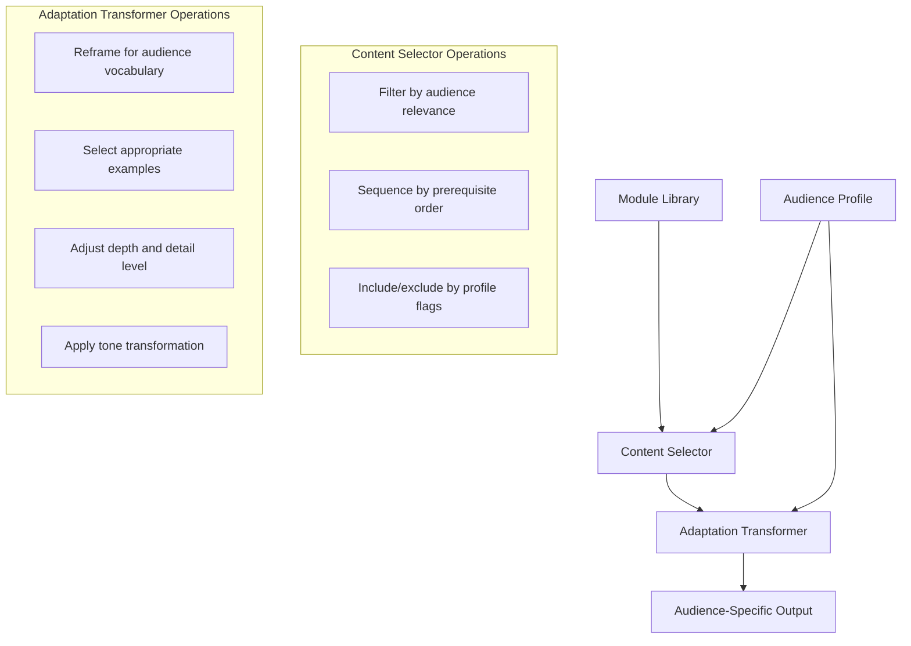

# Chapter 4: Multi-Audience Adaptation

## Learning Objectives

By the end of this chapter, you will be able to:

- Define audience profiles with the specificity required for content adaptation
- Design an adaptation layer that transforms a single content module into multiple audience outputs
- Apply role-based content filtering to select and sequence modules for each audience
- Implement variant generation using audience profiles and prompt templates
- Measure whether audience-adapted content is actually differentiated from generic content

---

## The Single Source, Multiple Output Problem

Most content teams maintain parallel content tracks for different audiences. The technical documentation team writes for developers. The enablement team writes for sales. The customer success team writes for end users. Each team works from their own copy of the facts.

The result is divergence. When the product changes, each team updates (or fails to update) their copy independently. Three months later, three teams are describing three slightly different versions of the same feature.

The alternative is a single source with multiple outputs. One set of structured facts in the knowledge graph. Multiple rendered outputs, each adapted to a specific audience's vocabulary, context, goals, and depth preference. The facts are updated once; the outputs are regenerated.

This requires solving two problems: first, how to represent audiences precisely enough that adaptation can be automated; second, how to transform a generic content module into an audience-specific one without manual rewriting.

---

## Audience Profiling

An audience profile is a structured specification of a learner persona with enough precision to drive content adaptation decisions. A vague persona ("technical users") is not useful. A precise profile enables automation.

A complete audience profile contains:

**Identity**
- Role name and common job titles
- Domain background and assumed knowledge
- Organizational context (team size, reporting structure, buying authority)

**Knowledge baseline**
- Technical depth (what vocabulary is assumed vs. defined)
- Domain expertise (what concepts are already familiar)
- Product familiarity (new user vs. experienced practitioner)

**Goals and motivations**
- Primary task this person is trying to accomplish
- What success looks like for this role
- What risks or failures they are trying to avoid

**Content consumption patterns**
- Preferred format (conceptual overview vs. step-by-step procedure vs. reference)
- Available attention (deep reading vs. quick lookup)
- Context of use (before a call, during configuration, in a crisis)

**Vocabulary and framing**
- Preferred terminology (business outcome language vs. technical precision)
- Examples that resonate (their industry, their scale, their workflow)
- Tone preference (formal, direct, conversational)

Here is a concrete example of a well-specified audience profile:

```yaml
profile_id: sales-engineer
display_name: "Sales Engineer"
job_titles: ["Sales Engineer", "Solutions Engineer", "Pre-Sales Consultant"]

knowledge_baseline:
  technical_depth: moderate
  assumed_knowledge:
    - REST API concepts (not implementation)
    - JSON structure (reads, not writes)
    - Customer procurement and security review processes
  product_familiarity: new-to-moderate

goals:
  primary: "Answer technical objections during sales cycles without deep implementation knowledge"
  success: "Customer proceeds to proof of concept; no technical blockers in the deal"
  avoid: "Being caught unable to answer a basic technical question during a demo"

content_patterns:
  preferred_format: conceptual-overview + comparison-table
  attention_context: "15 minutes before a customer call; under pressure"
  lookup_frequency: high (reference during calls)

vocabulary:
  business_framing: true
  avoids: ["implementation details", "code examples", "error codes"]
  prefers: ["capabilities", "guardrails", "customer impact", "competitive differentiation"]
  example_context: "enterprise SaaS companies, 500-5000 seats"
```

This profile drives every adaptation decision: what to include, what to omit, how to frame it, what examples to use, what vocabulary to apply.

---

## The Adaptation Layer

The adaptation layer sits between the module library and the output renderer. Its job is to take a content module (written for general accuracy) and transform it for a specific audience profile.



The adaptation layer performs two classes of operation:

**Selection** — which modules to include at all, which sections within modules to surface, which depth of detail to render. A sales engineer needs the "what it does and why customers care" section of a rate limiting module; they do not need the error code reference table.

**Transformation** — how to express the selected content. The fact is the same; the expression changes. "Rate limiting controls the volume of API requests per time window" becomes "Our API access controls ensure enterprise customers get predictable, guaranteed capacity regardless of overall platform load."

---

## Role-Based Content Filtering

Filtering determines which content a given audience receives. Each module carries `audience_relevance` metadata specifying its relevance level for each role. The filtering logic is a query against the module registry.

```python
def select_modules_for_audience(
    outcome_id: str,
    audience_profile: dict,
    module_registry: list
) -> list:
    """
    Select and sequence modules for a specific audience and outcome.
    Returns ordered list of modules ready for adaptation.
    """
    role = audience_profile["profile_id"]

    # Get all modules relevant to this outcome
    outcome_modules = [
        m for m in module_registry
        if outcome_id in m.get("supports_outcomes", [])
    ]

    # Filter by audience relevance
    relevant_modules = [
        m for m in outcome_modules
        if m.get("audience_relevance", {}).get(role) in ["primary", "secondary"]
    ]

    # Sort: primary relevance before secondary
    relevant_modules.sort(
        key=lambda m: 0 if m["audience_relevance"][role] == "primary" else 1
    )

    # Order by prerequisite dependencies (topological sort)
    return topological_sort(relevant_modules)
```

The output is an ordered list of modules, filtered for relevance and sequenced by dependency. This list is the input to the adaptation transformer.

---

## Vocabulary and Framing Adaptation

The same technical fact needs different expression for different audiences. This is not dumbing down — it is translating between professional vocabularies, each legitimate for its context.

Consider this fact from the knowledge graph:

> Rate limits are enforced per API key on a rolling 60-second window. The Developer API free tier allows 100 requests per window. Exceeding the limit returns HTTP 429 with a Retry-After header.

For an **integration developer**:
> The API enforces a rolling 60-second rate limit per API key. Free tier allows 100 requests per minute. Responses exceeding the limit return HTTP 429 with a `Retry-After` header specifying seconds until reset. Implement exponential backoff for robust error handling.

For a **sales engineer**:
> The platform provides tiered API access with built-in capacity controls. Customers on the free tier receive 100 API calls per minute, with Pro and Enterprise tiers providing higher limits custom-configured for their scale. The system automatically signals when limits are reached, enabling well-behaved integrations.

For a **system administrator**:
> Rate limits apply per API key, not per account. Each key has an independent limit. To distribute load, issue separate API keys to different integrated systems. Monitor usage via the API dashboard; alerts can be configured when any key approaches its limit.

Each version describes the same facts accurately. Each uses vocabulary appropriate to the role. Each emphasizes the aspect most relevant to what that role needs to do.

This vocabulary transformation is implemented as a prompt instruction that includes the audience profile and the source module, with explicit instruction to translate (not omit or invent) the facts:

```
ADAPTATION TASK:
Below is a content module written in neutral technical language.
Adapt it for the following audience profile: [paste profile]

Rules:
- Include all facts present in the source module (do not omit)
- Translate vocabulary according to the audience's preferences
- Reframe emphasis to match the audience's primary goal
- Use examples from the audience's context
- Do not add facts not present in the source module

SOURCE MODULE:
[paste source content]
```

---

## Content Variants: Design and Storage

When adaptation is automated, each audience gets its own content variant. Variants require a storage and naming convention that preserves the source relationship.

```
modules/
  concept-rate-limiting-api.yaml          # Source module (canonical)
  variants/
    concept-rate-limiting-api--integration-developer.yaml
    concept-rate-limiting-api--sales-engineer.yaml
    concept-rate-limiting-api--system-administrator.yaml
    concept-rate-limiting-api--end-user.yaml
```

Each variant file contains:
- `source_module_id`: the canonical module this was derived from
- `source_version`: the version of the source at generation time
- `audience_profile`: the profile used for adaptation
- `generated_at`: timestamp
- `reviewed_by`: human reviewer (after approval)
- `body`: the adapted content

When the source module is updated, variant files with a `source_version` that no longer matches the current source version are automatically flagged as stale. This is the connection between multi-audience adaptation and drift detection (Chapter 6).

---

## Measuring Adaptation Quality

Audience adaptation is only useful if the variants are genuinely differentiated. A common failure mode is generating variants that look superficially different but carry the same content at the same depth with different vocabulary — "adaptation theater."

Measure adaptation quality with these checks:

**Vocabulary differentiation ratio** — Count the percentage of technical terms (from a defined technical term list) present in each variant. An integration developer variant should have high technical term density; a sales engineer variant should have low density. If variants cluster around the same ratio, adaptation is not working.

**Section depth comparison** — Compare word count by section across variants. Different audiences should receive different depth on different sections. If all variants have approximately equal section lengths, selection logic is not filtering effectively.

**Audience blind test** — Show three variants without labels to three people representing each audience and ask them to identify which one is written for their role. If they cannot reliably identify the correct variant, the adaptation is insufficient.

**Example relevance audit** — Review the examples in each variant and verify they use industry, scale, and workflow references from the audience profile. Generic examples indicate the profile is not being applied.

---

## Common Adaptation Failure Patterns

**Over-filtering** — Too many modules excluded for an audience, leaving gaps in concept coverage. Result: the adapted content does not make sense without the omitted context.

**Under-adaptation** — Vocabulary and framing not changed enough. Result: sales engineers receive content that reads like developer documentation with a few words swapped.

**False differentiation** — Variants structurally differ (different order, different headers) but carry the same depth and framing. Result: content authors maintain four variants with no actual benefit.

**Profile drift** — Audience profiles defined during initial design are not updated as the actual audience evolves. Result: adaptation targets an audience that no longer matches the people using the content.

---

## Practical Implementation: Starting With Two Audiences

Full multi-audience adaptation across five or more profiles is an ambitious undertaking. Start with two audiences that have clearly different needs — typically technical (developer/admin) and commercial (sales/business).

Define those two profiles precisely. Build the adaptation prompt and generate a batch of 10-15 modules for both audiences. Run the adaptation quality checks. Validate with real members of each audience before scaling.

This two-audience prototype reveals whether your profile specification is precise enough to drive meaningful adaptation, whether your source modules are written at a level of generality that supports transformation, and whether your review process can handle the volume increase. Fix these problems at small scale before expanding to six profiles.

---

## Key Takeaways

- Multi-audience adaptation requires precise audience profiles — specific vocabulary, goals, context, and knowledge baseline — not general personas.
- The adaptation layer performs two operations: selection (what to include) and transformation (how to express it).
- Role-based filtering uses module `audience_relevance` metadata and prerequisite ordering to produce an audience-specific module sequence.
- Vocabulary adaptation translates the same facts into each audience's professional vocabulary — it does not omit or embellish.
- Variants are stored with source module references and source version numbers, enabling drift detection when the source is updated.
- Measure adaptation quality with vocabulary differentiation ratio, section depth comparison, and audience blind tests.
- Start with two clearly differentiated audiences, validate quality, then scale to additional profiles.

---

*Chapter 5: Automated Quality Assurance — Building validation pipelines that catch inconsistencies, style violations, and factual drift before publication.*
