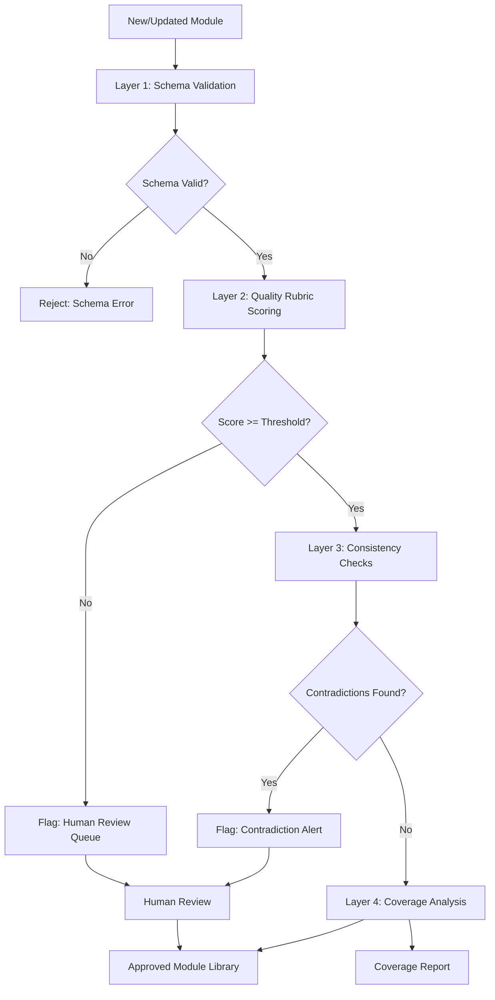

# Chapter 5: Automated Quality Assurance

## Learning Objectives

By the end of this chapter, you will be able to:

- Design a multi-layer validation pipeline for content module quality
- Implement rubric-based scoring that catches style, structure, and accuracy violations
- Build coverage scoring that identifies gaps in concept and audience coverage
- Create consistency checks that detect contradictions between modules
- Configure automated QA to run as part of the content review workflow

---

## Why Content Quality Cannot Be Manual at Scale

Manual content review is the standard in most documentation operations. A subject matter expert reads a draft. An editor checks style. A product manager approves. The process works acceptably when content volume is low and change frequency is manageable.

In an AI-augmented content system generating hundreds of modules across multiple audiences, manual review cannot keep up. More importantly, manual review is not systematic — different reviewers catch different things, the same reviewer catches different things on different days, and there is no audit trail showing what was checked and what was found.

Automated quality assurance does not replace human judgment. It replaces the mechanical checks that humans should not be doing manually: format validation, terminology consistency, length targets, required field completeness, coverage gaps. When these checks run automatically, human reviewers can focus on the judgment calls that require domain expertise and contextual reasoning.

---

## The QA Pipeline Architecture

A content QA pipeline has three layers of increasing sophistication:



**Layer 1: Schema Validation** — Binary pass/fail. Does the module have all required fields? Are field types correct? Is the module ID unique? Is the version number valid? Schema violations are rejected immediately with a specific error message.

**Layer 2: Quality Rubric Scoring** — Scored assessment against style and quality criteria. Produces a numeric score; modules below the threshold are routed to human review with the scoring breakdown.

**Layer 3: Consistency Checks** — Cross-module comparison to detect contradictions, duplicate content, and conflicting terminology.

**Layer 4: Coverage Analysis** — Graph-level analysis of what is covered, what is missing, and which audiences have gaps.

---

## Layer 1: Schema Validation

Schema validation uses a defined module schema (introduced in Chapter 2) and validates every module against it. This is implemented as a JSON Schema or Pydantic model validation.

```python
from pydantic import BaseModel, validator
from typing import Optional, Literal
from datetime import date
import re

VALID_STATUSES = ["draft", "review", "approved", "deprecated"]
VALID_MODULE_TYPES = ["concept", "procedure", "reference", "example", "warning"]
VALID_RELEVANCE = ["primary", "secondary", "none"]

class AudienceRelevance(BaseModel):
    integration_developer: Optional[Literal["primary", "secondary", "none"]] = None
    system_administrator: Optional[Literal["primary", "secondary", "none"]] = None
    sales_engineer: Optional[Literal["primary", "secondary", "none"]] = None
    end_user: Optional[Literal["primary", "secondary", "none"]] = None

class ContentModule(BaseModel):
    module_id: str
    module_type: Literal["concept", "procedure", "reference", "example", "warning"]
    version: str
    title: str
    body: str
    source_reference: str
    audience_relevance: AudienceRelevance
    last_verified: date
    status: Literal["draft", "review", "approved", "deprecated"]

    @validator("module_id")
    def id_must_be_slug(cls, v):
        if not re.match(r'^[a-z0-9][a-z0-9\-]+[a-z0-9]$', v):
            raise ValueError("module_id must be lowercase slug (letters, numbers, hyphens)")
        return v

    @validator("version")
    def version_must_be_semver(cls, v):
        if not re.match(r'^\d+\.\d+\.\d+$', v):
            raise ValueError("version must follow semver format: MAJOR.MINOR.PATCH")
        return v

def validate_module(module_data: dict) -> tuple[bool, list[str]]:
    try:
        ContentModule(**module_data)
        return True, []
    except Exception as e:
        errors = [str(err) for err in e.errors()]
        return False, errors
```

Schema validation runs in milliseconds and catches a large class of authoring errors before they consume reviewer time.

---

## Layer 2: Quality Rubric Scoring

A quality rubric evaluates each module against a set of weighted criteria. The rubric is designed by content operations leaders and encodes the standards that would otherwise live in a style guide and require human interpretation.

### Rubric Design

A rubric for concept modules:

| Criterion | Weight | Evaluation Method |
|-----------|--------|-------------------|
| Definition clarity | 15% | Definition field present, 1-3 sentences, no jargon without definition |
| Length target | 10% | Body between 200-500 words |
| No forbidden phrases | 15% | Regex check: "simply," "just," "easy," "straightforward," etc. |
| Active voice ratio | 10% | NLP passive voice detection |
| Source reference present | 20% | `source_reference` field populated |
| Audience relevance specified | 15% | At least one role set to "primary" |
| No placeholder text | 15% | No "[TBD]", "[PLACEHOLDER]", "[INSUFFICIENT DATA]" in approved status |

### Rubric Implementation

```python
import re
from spacy import load as spacy_load

nlp = spacy_load("en_core_web_sm")

FORBIDDEN_PHRASES = [
    r'\bsimply\b', r'\bjust\b', r'\beasy\b', r'\beasily\b',
    r'\bstraightforward\b', r'\bobviously\b', r'\bof course\b'
]

PLACEHOLDER_PATTERNS = [
    r'\[TBD\]', r'\[PLACEHOLDER\]', r'\[INSUFFICIENT DATA\]',
    r'\[INSERT\]', r'\[FIXME\]'
]

def score_module(module: dict) -> dict:
    body = module.get("body", "")
    scores = {}

    # Length target (200-500 words for concept)
    word_count = len(body.split())
    if module["module_type"] == "concept":
        if 200 <= word_count <= 500:
            scores["length_target"] = 1.0
        elif 150 <= word_count < 200 or 500 < word_count <= 600:
            scores["length_target"] = 0.5
        else:
            scores["length_target"] = 0.0

    # Forbidden phrases
    forbidden_found = sum(
        1 for p in FORBIDDEN_PHRASES if re.search(p, body, re.IGNORECASE)
    )
    scores["forbidden_phrases"] = max(0, 1.0 - (forbidden_found * 0.25))

    # Source reference
    scores["source_reference"] = 1.0 if module.get("source_reference") else 0.0

    # Audience relevance
    relevance = module.get("audience_relevance", {})
    has_primary = any(v == "primary" for v in relevance.values())
    scores["audience_relevance"] = 1.0 if has_primary else 0.0

    # Placeholder check (critical for approved status)
    has_placeholder = any(re.search(p, body) for p in PLACEHOLDER_PATTERNS)
    scores["no_placeholder"] = 0.0 if has_placeholder else 1.0

    # Weighted composite
    weights = {
        "length_target": 0.10,
        "forbidden_phrases": 0.15,
        "source_reference": 0.20,
        "audience_relevance": 0.15,
        "no_placeholder": 0.40
    }

    composite = sum(scores[k] * weights[k] for k in weights)

    return {
        "module_id": module["module_id"],
        "composite_score": round(composite, 3),
        "criterion_scores": scores,
        "passed": composite >= 0.75,
        "flags": [k for k, v in scores.items() if v < 0.5]
    }
```

The composite score and failing criteria are included in the review queue interface, so human reviewers know exactly what to look at.

---

## Layer 3: Consistency Checks

Consistency checks operate across the module library, not just on individual modules. They detect:

**Terminology contradictions** — Two modules use different terms for the same concept. Example: one module calls it "API key," another calls it "access token," a third calls it "client credential." The check compares noun phrases across modules and flags clusters with high semantic similarity but different terminology.

**Factual contradictions** — Two modules make conflicting factual claims about the same entity. Example: one module states the rate limit is 100 requests/minute, another states 1000. This check uses entity extraction to identify claims about the same entity and compares them.

**Coverage duplication** — Two modules substantially overlap in content. This indicates either a boundary problem (two modules that should be one) or duplication (one module that should reference the other). Detected via cosine similarity on embeddings.

```python
from sentence_transformers import SentenceTransformer
from sklearn.metrics.pairwise import cosine_similarity
import numpy as np

model = SentenceTransformer('all-MiniLM-L6-v2')

def check_duplication(modules: list, threshold: float = 0.88) -> list:
    """Identify module pairs with suspiciously high content overlap."""
    bodies = [m["body"] for m in modules]
    ids = [m["module_id"] for m in modules]

    embeddings = model.encode(bodies)
    similarity_matrix = cosine_similarity(embeddings)

    duplicates = []
    n = len(modules)
    for i in range(n):
        for j in range(i + 1, n):
            if similarity_matrix[i][j] >= threshold:
                duplicates.append({
                    "module_a": ids[i],
                    "module_b": ids[j],
                    "similarity": round(float(similarity_matrix[i][j]), 3),
                    "action": "review for merger or consolidation"
                })

    return duplicates
```

---

## Layer 4: Coverage Scoring

Coverage analysis answers the question: for each audience and each learning outcome, how complete is the content?

Coverage scoring works by traversing the knowledge graph and comparing required concepts (nodes reachable from outcome nodes via prerequisite chains) against available, approved modules.

```python
def calculate_coverage(
    graph,
    outcomes: list,
    audience_profile: str,
    module_registry: list
) -> dict:
    """
    Calculate content coverage for an audience relative to a set of outcomes.
    Returns coverage ratio and list of gaps.
    """
    # All concepts required for these outcomes
    required_concepts = set()
    for outcome in outcomes:
        prereqs = nx.ancestors(graph, outcome)
        required_concepts.update(prereqs)
        required_concepts.add(outcome)

    # Approved modules for this audience
    covered_concepts = {
        m["maps_to_concept"]
        for m in module_registry
        if (
            m["status"] == "approved" and
            m.get("audience_relevance", {}).get(audience_profile) in ["primary", "secondary"]
        )
    }

    covered = required_concepts & covered_concepts
    gaps = required_concepts - covered_concepts

    return {
        "audience": audience_profile,
        "outcomes": outcomes,
        "required_concepts": len(required_concepts),
        "covered_concepts": len(covered),
        "coverage_ratio": len(covered) / len(required_concepts) if required_concepts else 0,
        "gaps": sorted(list(gaps)),
        "coverage_score": round(len(covered) / len(required_concepts) * 100, 1) if required_concepts else 100
    }
```

The coverage report surfaces three actionable views:

1. **By audience** — Which roles have the highest coverage gaps?
2. **By outcome** — Which learning outcomes have the most missing prerequisites?
3. **By priority** — Which gaps block the highest number of outcomes (high-leverage items to address first)?

---

## Integrating QA Into the Review Workflow

QA checks run at two points in the content lifecycle:

**Pre-merge validation** — Run schema validation and rubric scoring as a pre-commit or CI/CD check. Modules that fail schema validation cannot be merged. Modules that fail rubric scoring are blocked for human review before merging.

**Nightly full-library audit** — Run consistency checks and coverage analysis across the full module library nightly. The output is a QA dashboard showing:
- Coverage score by audience
- Number of modules pending human review
- Active contradiction flags
- Terminology inconsistency reports
- Trend lines over time

The nightly audit is a reporting layer, not a blocking gate. It surfaces systemic issues for content operations review.

---

## QA Dashboard Metrics

The QA dashboard should report, at minimum:

| Metric | Description | Target |
|--------|-------------|--------|
| Schema pass rate | % of new modules passing schema validation | >99% |
| Rubric pass rate | % of modules scoring >= 0.75 | >85% |
| Coverage by audience | % of required concepts with approved modules | >90% per audience |
| Contradiction count | Active unresolved contradictions | 0 |
| Duplication flags | Module pairs with >88% similarity | 0 |
| Review queue depth | Modules awaiting human review | <20 |
| Mean time to approve | Average days from submission to approval | <3 days |

Track these metrics over time. Coverage below 80% for any primary audience indicates a structural content investment problem. Review queue depth above 50 indicates the automated pipeline is generating faster than humans can review — a signal to either increase reviewer capacity or raise quality thresholds to reduce queue volume.

---

## Key Takeaways

- Manual content review cannot scale with AI-augmented generation; automated QA shifts human effort to judgment calls rather than mechanical checks.
- The four-layer QA pipeline — schema validation, rubric scoring, consistency checks, coverage analysis — catches different failure modes at appropriate points.
- Schema validation is binary and fast; it catches structural failures before they consume review time.
- Quality rubric scoring is weighted and configurable; it encodes the style guide as executable logic rather than a document to be interpreted.
- Consistency checks operate across the module library to detect terminology contradictions, factual conflicts, and content duplication.
- Coverage scoring identifies gaps by traversing the knowledge graph and comparing required concepts against approved modules.
- QA integrates at two points: pre-merge validation (blocking gate) and nightly full-library audit (reporting layer).

---

*Chapter 6: Content Drift Detection — Monitoring systems that flag when training content falls out of sync with the product it describes.*
