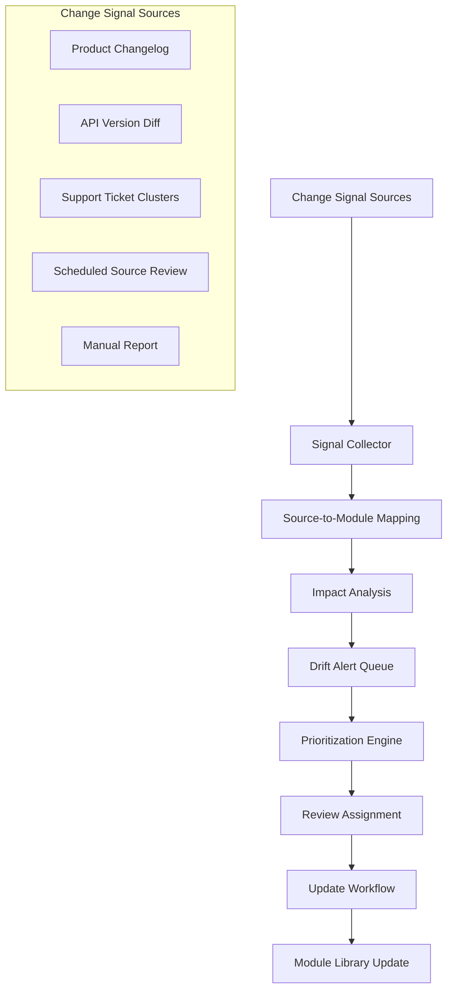

# Chapter 6: Content Drift Detection

## Learning Objectives

By the end of this chapter, you will be able to:

- Define content drift and explain why it is structurally different from authoring errors
- Design a drift detection system that monitors multiple change signal sources
- Implement version tracking at the module level with source provenance
- Build automated alerts that trigger content review when upstream facts change
- Prioritize drift remediation based on content criticality and audience exposure

---

## What Content Drift Is

Content drift is the progressive divergence between what training materials say and what is currently true about the product or process they describe. Unlike authoring errors — mistakes introduced during writing — drift is correct content that becomes incorrect over time as the underlying reality changes.

Drift is structurally different because it is silent. An authoring error is wrong from the moment it is written; someone might catch it during review. Drifted content was correct at publication and passes every review checkpoint. It fails only when a learner acts on it and discovers the gap between what the training said and what the product actually does.

The conditions that create drift are universal in technology products:

- Feature behavior changes in a product release
- Configuration interfaces are redesigned
- API parameters are renamed, added, or deprecated
- Pricing tiers and limits are adjusted
- Compliance requirements change
- Supported integrations shift

In an organization publishing training content without drift detection, these changes propagate to content on a best-effort basis — usually triggered by learner complaints, support escalations, or accidental discovery. The average lag between product change and content update is measured in months, not days.

---

## The Drift Detection Architecture

A drift detection system monitors change signals from upstream sources and connects them to the content modules that reference those sources.



The system has three primary components:

**Signal Collection** — Ingesting change events from multiple upstream sources: product changelogs, API diffs, support ticket analysis, and scheduled review cycles.

**Impact Analysis** — Mapping change events to affected content modules using the source provenance data stored with each module. A change to "API Reference Section 4.2" should instantly identify all modules that carry `source_reference: "API Reference v3.2, Section 4.2"`.

**Drift Alert Queue** — A prioritized queue of modules flagged for review, with context about what changed and why the module may be affected.

---

## Change Signal Sources

No single source captures all the ways product reality diverges from training content. A robust drift detection system monitors multiple signal types.

### Changelog Analysis

Product and API changelogs are the most reliable source of change signals. A change entry in the changelog should map directly to affected knowledge graph nodes, which then map to affected modules.

Changelog parsing can be automated for structured changelogs (YAML-formatted releases, GitHub releases, JIRA release notes) and semi-automated for prose changelogs using LLM extraction.

```python
def extract_change_signals_from_changelog(changelog_text: str) -> list:
    """
    Use LLM to extract structured change signals from prose changelog.
    Returns list of signals with entity, change type, and description.
    """
    prompt = f"""
    Extract all product changes from this changelog entry as structured data.
    For each change, identify:
    - entity: the specific feature, API endpoint, setting, or concept that changed
    - change_type: added | removed | modified | renamed | deprecated
    - description: one sentence describing what changed
    - affected_versions: version numbers if specified

    Return as JSON array.

    CHANGELOG:
    {changelog_text}
    """

    response = client.messages.create(
        model="claude-opus-4-6",
        max_tokens=2048,
        messages=[{"role": "user", "content": prompt}]
    )

    return json.loads(response.content[0].text)
```

### API Diff Analysis

For API-centric products, comparing API specifications across versions (OpenAPI, GraphQL schema, Protobuf definitions) provides precise, structured change signals.

An API diff identifies:
- Endpoints added, removed, or modified
- Parameters renamed or deprecated
- Response schema changes
- Authentication requirement changes
- Rate limit changes in API documentation

Tools like `openapi-diff`, `graphql-inspector`, and custom spec comparison scripts generate structured diffs that can be fed directly into the impact analysis stage.

### Support Ticket Clustering

Support tickets where users report behavior contradicting the documentation are a lagging indicator of drift — they fire after learners have already been affected. But they are valuable for confirming which drifted content causes real problems and should be prioritized.

A weekly clustering job groups support tickets by theme, identifies clusters containing documentation-related complaints, and creates manual review signals for affected content areas.

### Scheduled Source Review

Not all source documents emit machine-readable change signals. Technical specifications, compliance documents, and operational procedures may be updated without version-controlled changelogs.

For these sources, scheduled review is the mechanism: each module's `next_review` date is set based on how frequently the source is likely to change. High-velocity sources (API reference, pricing page) get monthly review cycles. Stable sources (architectural overview, conceptual glossary) get annual review cycles.

An automated job checks `next_review` dates daily and adds overdue modules to the drift alert queue.

---

## Source Provenance: The Foundation of Impact Analysis

Drift detection requires knowing which content modules reference which upstream sources. Without this mapping, a changelog entry is an event with unknown content impact. With it, a changelog entry triggers a precise list of affected modules.

Source provenance is stored with every module at creation time:

```yaml
module_id: concept-rate-limiting-api
source_reference: "Developer API Reference v3.2, Section 4.2"
source_url: "https://internal-docs.example.com/api-reference/v3.2/rate-limiting"
source_version_hash: "sha256:a4f8c2..."  # Hash of source content at verification time
last_verified: "2025-11-01"
next_review: "2026-02-01"
```

The `source_version_hash` enables drift detection without changelog integration: a daily job fetches each source document, computes its hash, and compares it to the stored hash. If the hash differs, the source has changed and the module is flagged for review.

This hash-based approach works for any web-accessible or file-system-accessible source document, regardless of whether the source emits structured change signals.

---

## Variant Chain Drift

Multi-audience content (Chapter 4) introduces a second drift vector: when a source module is updated, all derived variants are also stale.

Each variant stores a reference to the source module version that generated it:

```yaml
module_id: concept-rate-limiting-api--sales-engineer
source_module_id: concept-rate-limiting-api
source_module_version: "1.2.0"
generated_at: "2025-11-01"
```

When the source module is updated to version `1.3.0`, a query against the variant registry identifies all variants with `source_module_version < 1.3.0`. These variants are automatically added to the drift alert queue with the tag "variant chain drift — regenerate or verify."

The typical resolution is to regenerate the variant from the updated source module using the adaptation pipeline, then route the regenerated variant through human spot-check review before publishing.

---

## Drift Prioritization

The drift alert queue accumulates faster than it can be worked at scale. Prioritization ensures the highest-impact content gets reviewed first.

Prioritization uses three factors:

**Audience exposure** — How many learners have consumed this module in the last 90 days? High-traffic modules that drift affect more learners. Module view counts from the learning platform or documentation analytics feed this score.

**Outcome criticality** — What outcomes does this module support? Modules supporting compliance certification, customer onboarding, or safety-critical procedures have higher criticality than modules supporting optional features.

**Change severity** — How significant was the upstream change? A deprecated feature is higher severity than a label rename. An API endpoint removal is higher severity than a parameter description update.

```python
def calculate_drift_priority(
    module: dict,
    change_signal: dict,
    analytics: dict
) -> float:
    """
    Calculate priority score for a drifted module.
    Higher score = higher priority for review.
    Returns float between 0.0 and 1.0.
    """
    # Audience exposure (normalized to 0-1)
    views_90d = analytics.get(module["module_id"], {}).get("views_90d", 0)
    exposure_score = min(views_90d / 1000, 1.0)  # Cap at 1000 views = 1.0

    # Outcome criticality
    criticality_map = {"compliance": 1.0, "onboarding": 0.8, "feature": 0.5, "reference": 0.3}
    criticality_score = max(
        criticality_map.get(outcome_type, 0.3)
        for outcome_type in module.get("supports_outcome_types", ["reference"])
    )

    # Change severity
    severity_map = {"removal": 1.0, "deprecation": 0.9, "behavior_change": 0.7,
                    "rename": 0.4, "description_update": 0.2}
    severity_score = severity_map.get(change_signal.get("change_type", "description_update"), 0.3)

    # Weighted composite
    priority = (
        exposure_score * 0.35 +
        criticality_score * 0.40 +
        severity_score * 0.25
    )

    return round(priority, 3)
```

The prioritized queue presents reviewers with the highest-impact drifted content first, ensuring that the most critical corrections happen before lower-stakes ones.

---

## Drift Remediation Workflow

When a module is pulled from the drift alert queue for remediation, the reviewer follows a structured process:

**Step 1: Verify the drift** — Compare the current module content against the current state of the source. Confirm that the change signal is relevant to this module's specific claims. Not every source change affects every module that references the source.

**Step 2: Classify the impact** — Is the module's content now incorrect? Outdated but not wrong? Incomplete (missing new information)? The classification determines the severity of the correction.

**Step 3: Update the knowledge graph** — If the underlying facts have changed, update the knowledge graph node first. The node is the source of truth; the module is derived.

**Step 4: Update or regenerate the module** — Either edit the module directly (for small corrections) or regenerate it from the updated graph node using the generation pipeline (for substantial changes).

**Step 5: Update metadata** — Set `last_verified` to today, update `source_version_hash`, set `next_review` based on the source's change velocity.

**Step 6: Trigger variant updates** — If the module has audience variants, add them to the regeneration queue.

---

## Drift Metrics

Track drift as a system health metric:

| Metric | Description | Target |
|--------|-------------|--------|
| Drift alert resolution time | Median days from alert to reviewed module | <7 days |
| Queue aging | % of alerts older than 14 days | <10% |
| Source coverage | % of modules with source_reference populated | >95% |
| Review cycle compliance | % of modules reviewed before next_review date | >90% |
| Drift incident rate | Support tickets attributable to stale content | Trending down |

Drift incident rate — tracking how often learner confusion or support escalations can be traced back to stale content — is the business-level metric that demonstrates the value of the drift detection system. Track it before implementing the system to establish a baseline, then compare at 3 and 6 months.

---

## Key Takeaways

- Content drift is silent: content that was correct at publication becomes incorrect as the product changes, passing all review checkpoints until a learner encounters the discrepancy.
- The drift detection architecture monitors change signals from changelogs, API diffs, support ticket clusters, and scheduled source reviews.
- Source provenance — storing the source reference, URL, and version hash with every module — is the prerequisite for automated impact analysis when changes occur.
- Variant chain drift occurs when a source module is updated; all derived audience variants must be flagged for regeneration or verification.
- Prioritization uses three factors: audience exposure, outcome criticality, and change severity. High-traffic compliance content that references a removed feature gets the highest priority.
- The drift remediation workflow updates the knowledge graph first, then the module, then triggers variant updates.
- Drift incident rate (support escalations traceable to stale content) is the business-level metric that demonstrates system value.

---

*Chapter 7: Metrics and Learner Outcomes — Connecting content consumption data to learner performance, identifying what works and what doesn't.*
