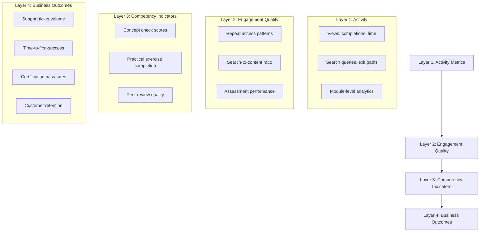

# Chapter 7: Metrics and Learner Outcomes

## Learning Objectives

By the end of this chapter, you will be able to:

- Distinguish between content activity metrics and learner outcome metrics
- Design a measurement framework that connects content consumption to downstream performance
- Identify the data sources required to build outcome-linked content analytics
- Build a content effectiveness scoring model for your module library
- Use metrics to make prioritization decisions about content investment

---

## The Vanity Metrics Problem

Documentation and training teams have always had access to activity metrics: page views, completion rates, time-on-page, download counts. These metrics are easy to collect and easy to report. They are also largely useless for evaluating whether the content is working.

A high page view count on a procedure module might mean the content is popular — or it might mean users cannot find the answer and keep returning, frustrated. A high completion rate on a course might indicate effective training — or a low-stakes assessment that everyone passes regardless of what they learned. A long time-on-page might indicate deep engagement — or confusion that causes users to reread content multiple times.

Activity metrics describe content consumption. Outcome metrics describe what happens after consumption. The difference is causal: did the content produce a behavior change, skill acquisition, or task completion that the organization values?

An AI-native content architecture system has an advantage here: because content is structured and modular, it is possible to link specific modules to specific outcomes and measure the relationship empirically.

---

## The Measurement Framework

A content effectiveness measurement framework has four layers:



Each layer provides evidence. The business case for content investment lives in Layer 4. The diagnostic capability for improving content lives in Layers 2 and 3. Layer 1 provides volume context.

---

## Layer 1: Activity Metrics (Baseline)

Activity metrics establish the volume and distribution of content usage. They answer "who is using what and when" — necessary context for outcome analysis but not evidence of effectiveness on their own.

**Module-level metrics to track:**

| Metric | How to Collect | What It Tells You |
|--------|---------------|-------------------|
| Unique views | Analytics platform | How many learners encountered this module |
| Repeat views | Session tracking | How often learners return (engagement or confusion?) |
| Completion rate | Scroll/time triggers | How many read to the end |
| Time-on-page | Session duration | Relative reading depth |
| Entry source | Referrer tracking | How learners find this content (search, link, nav) |
| Exit destination | Next-page tracking | What learners do after reading |
| Copy events | Clipboard API | Code examples and procedures being used |

Activity metrics become more useful when segmented by audience role. A procedure module with high views from integration developers and low views from system administrators may indicate an audience relevance misconfiguration, not a content problem.

---

## Layer 2: Engagement Quality

Engagement quality metrics distinguish active use from passive exposure.

**Search-to-content ratio** — If learners frequently search for terms that appear in your content without finding that content, your taxonomy, tagging, or navigation is failing. Track the ratio of successful search sessions (search → click → no further search) to unsuccessful ones (search → no click → reformulation).

**Repeat access with progression** — A learner who returns to a module three times at increasing time intervals (one day, one week, two weeks) demonstrates active recall practice — the strongest predictor of retention. A learner who returns three times in one hour is probably confused.

**Assessment performance vs. content consumption** — If learners who complete a module before a concept check score significantly higher than those who skip it, the module is doing its job. If performance is statistically similar, the module is not adding value and should be redesigned or eliminated.

```python
def calculate_module_effectiveness(
    module_id: str,
    assessment_results: list,
    content_consumption: list
) -> dict:
    """
    Compare assessment performance between content consumers and non-consumers.
    """
    consumers = {
        r["learner_id"] for r in content_consumption
        if r["module_id"] == module_id and r["completion_rate"] >= 0.8
    }

    consumer_scores = [
        r["score"] for r in assessment_results
        if r["learner_id"] in consumers and module_id in r.get("related_modules", [])
    ]

    non_consumer_scores = [
        r["score"] for r in assessment_results
        if r["learner_id"] not in consumers and module_id in r.get("related_modules", [])
    ]

    if not consumer_scores or not non_consumer_scores:
        return {"module_id": module_id, "status": "insufficient_data"}

    return {
        "module_id": module_id,
        "consumer_mean_score": sum(consumer_scores) / len(consumer_scores),
        "non_consumer_mean_score": sum(non_consumer_scores) / len(non_consumer_scores),
        "score_lift": (
            sum(consumer_scores) / len(consumer_scores) -
            sum(non_consumer_scores) / len(non_consumer_scores)
        ),
        "sample_sizes": {
            "consumers": len(consumer_scores),
            "non_consumers": len(non_consumer_scores)
        }
    }
```

---

## Layer 3: Competency Indicators

Competency indicators measure whether learners can demonstrate the skills and knowledge the content intended to develop. These are the closest direct measures of content effectiveness.

**Concept checks** — Short embedded questions that verify understanding of the key ideas in a module. Not graded assessments; checkpoints that surface confusion before it compounds.

A well-designed concept check for a rate limiting module might ask:
- "A client receives an HTTP 429 response. What should its next action be?" (tests procedure application)
- "Your free tier API key has a limit of 100 requests per minute. You need to make 800 requests in 5 minutes. What is required?" (tests limit arithmetic and upgrade understanding)

Track first-attempt success rates by concept check question. Questions with low success rates indicate either confusing content (the module does not explain the concept clearly) or an overly difficult question (the question tests something the module does not cover). Distinguish the two by examining which parts of the module learners spent the most time on.

**Practical exercise completion quality** — For hands-on exercises (configure a feature, write a script, map a workflow), rate completion quality on a rubric rather than tracking binary completion. A learner who completes an exercise incorrectly has a different learning need than one who skips it.

**Trainer confidence surveys** — For internal enablement content, trainers who deliver based on your content can report confidence by topic. Low confidence in a specific area typically indicates content gaps, not trainer skill gaps. This is a leading indicator — trainers lose confidence before learners show deficits.

---

## Layer 4: Business Outcomes

Business outcomes are the reason content investments are made. They are also the hardest to attribute directly to specific content, because many factors influence them. Approach attribution with appropriate humility while still making the connection explicit.

**Support ticket volume by topic** — Track support tickets by product area and correlate with content coverage and content quality scores for those areas. After investing in a module for a previously under-documented feature, does support volume for that feature decrease? This is an imperfect correlation but a directionally useful one.

**Time-to-first-success** — For customer onboarding, measure the time from account creation to first successful use of a key feature (first API call, first data import, first report generated). Improvements in onboarding content should compress this metric. Establish a baseline before content investment and track it at 60, 90, and 180 days.

**Certification pass rates** — If your content supports a partner or customer certification program, pass rates are a direct outcome measure. Track pass rates by cohort, examine which assessment sections have the lowest scores, and trace those sections back to specific content modules.

**Task completion rates post-training** — For operational training (system administrators completing a compliance configuration, sales engineers successfully demoing a feature), measure whether the target task is completed within a defined window after training. If 80% of trained administrators successfully complete a compliance configuration within 30 days, and 50% of untrained administrators do so, the training is demonstrably effective.

---

## Trainer Confidence as a Leading Metric

One of the most underused metrics in content operations is trainer confidence — the self-reported ability of internal trainers and enablement teams to teach each topic with accuracy and confidence.

Trainer confidence is a leading indicator because trainers are downstream consumers of your content. When content is outdated, incomplete, or unclear, trainers notice before learners do. A quarterly trainer confidence survey (5 minutes, rated by topic area on a 1-5 scale) produces a heat map of content quality from the perspective of those who use it most intensively.

Low confidence scores on specific topics indicate content investment priorities with higher signal quality than page view data alone.

```
TRAINER CONFIDENCE SURVEY TEMPLATE

Rate your confidence teaching each topic to [audience] (1 = not confident, 5 = very confident):

Topic | 1 | 2 | 3 | 4 | 5 | Comments
API Rate Limiting | [ ] | [ ] | [ ] | [ ] | [ ] | ___________
OAuth 2.0 Setup | [ ] | [ ] | [ ] | [ ] | [ ] | ___________
Webhook Configuration | [ ] | [ ] | [ ] | [ ] | [ ] | ___________

What topic do you most frequently struggle to answer questions about? ___________
What topic do learners most frequently ask about that is NOT in the current content? ___________
```

Aggregate quarterly and track trend. A topic dropping from 4.2 to 3.1 average confidence between quarters is a drift or coverage signal that warrants investigation.

---

## Content Effectiveness Scoring

Combining Layer 1-4 data produces a content effectiveness score for each module — a composite indicator that drives investment decisions.

```
Effectiveness Score Components:
- Engagement signal (0-25 pts): completion rate + repeat engagement ratio
- Competency signal (0-35 pts): concept check lift + exercise completion quality
- Outcome signal (0-40 pts): support ticket reduction correlation + task completion rate

Composite range: 0-100
High (75+): Content performing well; maintain with regular drift checks
Medium (50-74): Content adequate; candidate for targeted improvement
Low (<50): Content underperforming; priority for redesign or elimination
```

Calculate effectiveness scores quarterly. Modules consistently scoring below 50 despite revision investment are candidates for elimination — their continued maintenance may cost more than the value they deliver.

---

## Building a Metrics Infrastructure

Most content teams do not have a unified data infrastructure connecting content analytics to learning outcomes to business metrics. Building it does not require a data warehouse on day one.

**Minimum viable metrics setup:**
1. Analytics on your documentation platform (MkDocs, Confluence, Notion — all support basic analytics)
2. A spreadsheet connecting module IDs to concept check questions and results
3. A support ticket tagging system that labels tickets with product area
4. A quarterly trainer confidence survey

This minimum setup is sufficient to run quarterly effectiveness reviews and make defensible content investment decisions. As the system matures, integrate analytics APIs, connect to LMS data, and automate the effectiveness score calculation.

---

## Key Takeaways

- Activity metrics (views, completions, time-on-page) describe content consumption; they do not measure effectiveness.
- The four-layer measurement framework connects activity data to engagement quality, competency indicators, and business outcomes.
- Score lift on assessments — comparing performance between content consumers and non-consumers — is the most direct measure of module-level effectiveness.
- Trainer confidence surveys are a leading indicator of content quality problems; low confidence by topic predicts learner difficulty.
- Business outcome attribution is directionally useful even without perfect causality: support ticket volume trends, time-to-first-success, and certification pass rates all respond to content quality.
- Content effectiveness scores (composite of engagement, competency, and outcome signals) drive quarterly investment and elimination decisions.
- Start with a minimum viable metrics setup; the goal is defensible quarterly decisions, not a perfect data model.

---

*Chapter 8: Scaling Content Operations — Organizational patterns, tooling, and workflows that let small teams maintain large content surfaces.*
