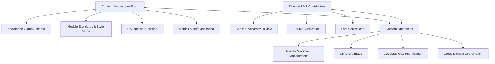
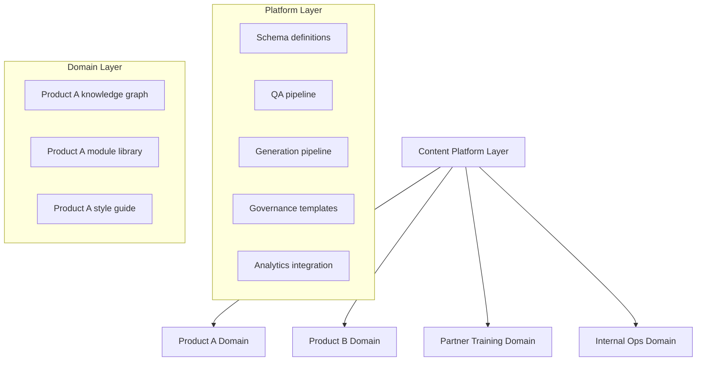

# Chapter 8: Scaling Content Operations

## Learning Objectives

By the end of this chapter, you will be able to:

- Identify the operational bottlenecks that appear as content systems grow
- Design team structures that distribute content ownership without creating silos
- Implement governance frameworks that maintain quality as contributor count increases
- Build automation workflows that reduce per-module operational overhead
- Create an operational playbook for onboarding new content domains

---

## The Scaling Inflection Points

Content systems break at predictable scales. The patterns are consistent enough that you can anticipate them and design around them before they cause failure.

**Scale threshold 1: 1-5 contributors, <100 modules**
The system works on trust, shared memory, and direct communication. One person knows where everything is. Quality is maintained through personal standards. There is no formal process because the team does not need one. This is the state most content teams are in when they first encounter a problem.

**Scale threshold 2: 5-20 contributors, 100-500 modules**
The first failures appear. Two people edit the same module without coordination. A new contributor creates a module that already exists with a different title. Style diverges because the style guide lives in one person's head. A subject matter expert updates facts in a document without updating the corresponding module. The system that worked at scale 1 requires manual coordination overhead that grows with contributor count.

**Scale threshold 3: 20+ contributors, 500+ modules**
At this scale, manual coordination collapses entirely. The bottlenecks are structural: no single person can hold the module registry in their head, review all new content, or track all change signals. Without systematic process and tooling, quality degrades and coverage gaps accumulate faster than they can be addressed.

The goal of scaling content operations is to design the system so that each threshold is survivable — so that the jump from scale 2 to scale 3 does not require rebuilding the entire operation.

---

## Team Structure: Distributed Ownership

The most effective content operations structure at scale is distributed ownership with centralized standards. The content architecture team (often a small core team) maintains the knowledge graph schema, the module standards, the QA pipeline, and the tooling. Subject matter expert (SME) contributors own the accuracy of content in their domains. A content operations function coordinates workflow and escalations.

This structure separates three types of expertise that are frequently conflated:

- **Architectural expertise** — how content is structured, validated, and generated
- **Domain expertise** — whether the facts are correct
- **Operational expertise** — how the workflow runs

Conflating all three in a single team (or a single person) creates a bottleneck. A domain expert who also has to run the QA pipeline is spending time on tasks that do not require domain expertise. An architect who also has to verify product facts is dependent on access to domain knowledge they may not have.

---

## Contributor Onboarding

At scale, the quality of your contributor onboarding process determines the quality of your module library. Every new contributor who joins without understanding module standards adds work for reviewers.

An effective contributor onboarding experience has four parts:

**Part 1: Standards documentation** — A concise contributor guide covering module types, metadata schema, style requirements, and forbidden patterns. Not a comprehensive manual; a reference that covers the most common decisions a contributor will face. Target: under 20 minutes to read, permanently bookmarked as a reference.

**Part 2: Guided first contribution** — A structured first contribution task with a designated reviewer who provides detailed feedback. This should be a real, needed module — not a training exercise — so the contributor's work adds immediate value. The reviewer comments should reference specific style guide sections, not just state preferences.

**Part 3: Tooling setup** — Schema validation and linting should run locally before a contributor can submit content. If the contributor's environment catches style violations, the review queue stays clean.

**Part 4: Review buddy system** — For the first 30 days, each new contributor is paired with an experienced one who reviews their submissions in detail. After 30 days, submissions enter the standard review queue. The buddy relationship serves both quality and contributor confidence.

Track first-contribution quality scores (rubric scores from Chapter 5) over time. If scores are consistently low for new contributors, the onboarding process is the problem, not the contributors.

---

## Governance: Quality Without Bottlenecks

Governance defines who can approve what, under what conditions. Poor governance creates one of two failure modes: bottleneck governance (everything requires approval from one person, creating a queue that grows faster than it is worked) or permissive governance (anything can be published without review, degrading quality over time).

Effective governance scales by differentiating approval requirements based on content risk.

| Content Change | Risk Level | Required Approval |
|---------------|------------|------------------|
| New draft module | Low | Schema validation (automated) |
| Minor correction to approved module | Low | Single peer review |
| Major rewrite of approved module | Medium | SME review + content operations sign-off |
| New concept added to knowledge graph | Medium | Architecture team review |
| Certification exam content | High | SME review + compliance sign-off + content operations |
| API reference module update | High | Engineering review + content operations |

This tiered approval system concentrates human review time where it matters most. Low-risk changes move quickly; high-risk changes get appropriate scrutiny without bottlenecking everything.

Implement governance as code: pull request templates that specify required reviewers based on module metadata (module type, audience criticality, certification-flag). Reviewers are automatically requested; approval requirements are enforced by branch protection rules.

---

## Automation Workflows

Operational overhead in a content system is primarily the sum of manual tasks that happen repeatedly. Identify the highest-frequency manual tasks and automate them first.

**High-frequency manual tasks at scale:**

1. **Module ID collision checking** — When a new module is submitted, does the ID already exist? Automate: registry lookup at submission time with auto-suggestion of similar existing modules.

2. **Prerequisite chain validation** — Does the new module reference prerequisites that exist and are approved? Automate: graph traversal check at submission time.

3. **Review assignment** — Who should review this module? Automate: based on module domain tags and reviewer expertise map, auto-assign reviewers.

4. **Variant staleness detection** — Which variants need regeneration after a source module update? Automate: registry query on source module version bump, auto-create regeneration tasks.

5. **Next review date setting** — What should this module's next review date be? Automate: based on source document change velocity, set standardized review cycles.

6. **Drift alert triage** — Which alerts in the queue are highest priority? Automate: priority scoring (Chapter 6) and queue ordering.

Each automation requires upfront investment but eliminates repeated manual effort. Prioritize automations that remove bottlenecks from the critical path of publishing new content.

---

## From 1 to 100 Content Systems

Organizations that prove the content architecture model for one product inevitably face pressure to scale it to others. This is the right instinct — but the replication path matters.

**Anti-pattern: Copy the repository**
Copy the module library and pipeline infrastructure from the first product and adapt it for the second. This works for one replication but produces divergent systems that are expensive to maintain and cannot share tooling improvements.

**Pattern: Extract the platform**
After the first successful deployment, extract the generalizable components into a shared platform:

- The knowledge graph schema (with domain-extension points)
- The module metadata schema
- The QA pipeline
- The generation pipeline templates
- The governance framework templates
- The contributor onboarding materials

Each new content domain uses the platform and customizes domain-specific components: the concept taxonomy, the audience profiles, the source references, the style guide vocabulary.

The platform layer is maintained by the content architecture team. Domain layers are maintained by domain owners with support from content operations. Platform improvements (better QA checks, new generation capabilities) apply to all domains automatically.

---

## Operational Playbook for New Domains

Each new content domain requires a structured onboarding process. An operational playbook specifies this process so it can be executed consistently without re-inventing it each time.

**Phase 1: Domain scoping (1-2 weeks)**
- Define the audience profiles for this domain
- Identify the learning outcomes and their priority order
- Map the source documents that will anchor the knowledge graph
- Estimate the concept and procedure count

**Phase 2: Knowledge graph seeding (2-4 weeks)**
- Extract entities from source documents
- Build the initial concept dependency graph
- Validate DAG structure
- Define source provenance for each node

**Phase 3: Module library initialization (2-4 weeks)**
- Generate initial module drafts for all primary audience / outcome combinations
- Run QA pipeline on all generated content
- Route flagged content to SME review
- Build review capacity plan (how many SME hours per week are available)

**Phase 4: Pilot and measurement baseline (4 weeks)**
- Publish to a limited audience
- Establish baseline metrics (activity, competency checks, trainer confidence)
- Collect feedback and identify high-priority gaps
- Calibrate QA thresholds for this domain

**Phase 5: Full deployment and operations handoff (2 weeks)**
- Publish to all intended audiences
- Assign domain owners for ongoing maintenance
- Set up drift monitoring for all source documents
- Schedule first quarterly metrics review

Total timeline: 11-16 weeks from kickoff to full deployment for a new domain. This cadence enables content operations to onboard 3-4 new domains per year without overwhelming the team.

---

## Measuring Operational Health

Track the operational health of the content system itself, separate from content effectiveness:

| Metric | Description | Target |
|--------|-------------|--------|
| Time-to-publish | Days from module submission to approved publication | <5 days |
| Review queue depth | Modules awaiting review | <30 |
| Automation coverage | % of manual tasks automated | >70% |
| Contributor retention | % of contributors who make a second contribution | >60% |
| Schema pass rate | % of submissions passing schema validation | >95% |
| Domain coverage ratio | Domains with complete operational playbook | 100% |

---

## Key Takeaways

- Content systems fail at predictable scale thresholds: 5-20 contributors (coordination failures) and 20+ contributors (structural collapse without systematic process).
- Distributed ownership with centralized standards separates architectural expertise, domain expertise, and operational expertise — three capabilities that should not be conflated.
- Governance scales through differentiated approval requirements: low-risk changes move quickly, high-risk changes get appropriate review without blocking everything.
- Automation priority should follow task frequency: automate the highest-frequency manual tasks first to remove bottlenecks from the content publication path.
- Scaling from one to many domains requires extracting a platform layer (schema, QA pipeline, governance templates) shared across all domains.
- The operational playbook for new domains (5 phases, 11-16 weeks) enables consistent replication without re-inventing the process each time.
- Operational health metrics (time-to-publish, review queue depth, automation coverage) are as important as content quality metrics.

---

*Chapter 9: Version Control for Training Content — Git-based workflows for content review, approval, rollback, and audit trails.*
