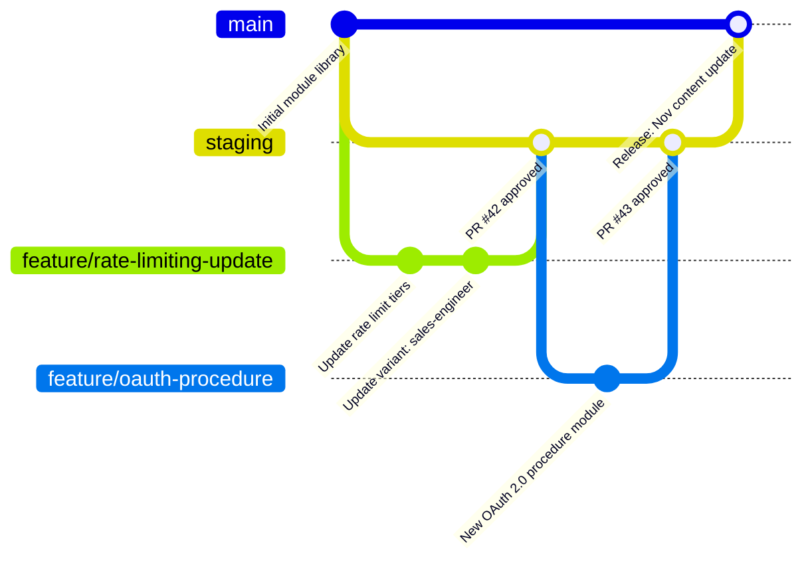

# Chapter 9: Version Control for Training Content

## Learning Objectives

By the end of this chapter, you will be able to:

- Apply git branching strategies to content repositories with multiple contributors and audience outputs
- Design a pull request review workflow that enforces quality gates before content is merged
- Implement rollback procedures for content that needs to be reverted after publication
- Build an audit trail that satisfies compliance and accountability requirements
- Integrate version control with the module metadata schema for content versioning

---

## Why Content Needs Version Control

Training content is code. It describes how a system works, what actions to take, and what results to expect. When the descriptions are wrong, people make mistakes — just as they do when running incorrect code. The analogy extends further: content changes frequently, multiple people contribute to it, different versions serve different purposes, and some versions need to be rolled back when problems are discovered.

Most documentation teams version content informally, if at all. They overwrite files when updates are needed, track history in filenames (`procedure-v2-FINAL-revised.docx`), and have no systematic way to recover a previous state or identify what changed between versions.

Git-based content management applies software development's most battle-tested version control system to content. It provides:

- Complete history of every change to every file
- Branching for parallel work without conflict
- Pull requests for structured review before changes are merged
- Blame history for accountability and auditing
- Tags for marking specific published states
- Revert capability for rolling back problematic changes

The investment in git workflows pays dividends at scale: when 20 contributors are working on content simultaneously, the alternative to version control is chaos.

---

## Repository Structure for Content Systems

The repository structure for a content system should separate concerns clearly: knowledge graph data, content modules, output templates, pipeline scripts, and rendered outputs.

```
content-system/
├── graph/
│   ├── concepts/
│   │   ├── rate-limiting-api.yaml
│   │   └── api-authentication.yaml
│   ├── procedures/
│   │   └── configure-rate-limit-tier.yaml
│   ├── roles/
│   │   └── profiles/
│   └── outcomes/
│       └── onboard-integration-developer.yaml
├── modules/
│   ├── concepts/
│   ├── procedures/
│   ├── references/
│   ├── examples/
│   ├── warnings/
│   └── variants/
├── templates/
│   ├── audience-outputs/
│   └── format-templates/
├── pipeline/
│   ├── generate.py
│   ├── validate.py
│   ├── adapt.py
│   └── publish.py
├── docs/
│   └── (rendered output — may be a separate repo or branch)
├── .github/
│   └── workflows/
│       ├── validate.yml
│       ├── generate.yml
│       └── publish.yml
└── registry.yaml
```

Keeping the graph, modules, and pipeline in the same repository enables atomic commits: a change to a knowledge graph node and the modules derived from it can be committed together, keeping the repository in a consistent state.

---

## Branching Strategy

A branching strategy for content systems adapts the software development branching model to content workflows. The key difference is that content has multiple audiences and potentially multiple publication targets, which maps naturally to branch structure.

### Core Branches

**`main`** — The current published state of approved content. All content in `main` has passed QA, received required approvals, and is visible to learners. Direct commits to `main` are prohibited; all changes come through pull requests.

**`staging`** — The integration branch for content that has passed initial review but is not yet published. This is where final checks run before merging to `main`. Useful for coordinating content releases that include multiple related modules.

**Feature branches** — Individual content work items. Branch from `main`, work on a specific module or group of related modules, open a pull request to `staging` or `main` when complete.



### Branch Naming Conventions

Clear branch naming makes the purpose of a branch immediately visible in pull request lists and git history:

```
module/concept-rate-limiting-api       # New or updated module
graph/add-bulk-import-concepts         # Knowledge graph changes
fix/proc-configure-sso-step-3          # Correction to existing content
variant/regenerate-sales-engineer      # Variant regeneration run
release/2025-q4                        # Coordinated release bundle
```

---

## Pull Request Workflow

The pull request is the primary quality gate in a git-based content workflow. Every change to `main` passes through a pull request, and every pull request runs automated checks and receives human review.

### Pull Request Template

A standardized PR template ensures that contributors provide the context reviewers need:

```markdown
## Content Change Summary

**Module(s) affected:**
- [ ] List module IDs

**Type of change:**
- [ ] New module
- [ ] Module update (correction or improvement)
- [ ] Module update (product change — upstream trigger)
- [ ] Variant regeneration
- [ ] Knowledge graph update

**Change description:**
<!-- What changed and why? Include the triggering event if product-driven. -->

**Source verification:**
<!-- What source document was consulted? Provide link or reference. -->

**Audience impact:**
<!-- Which audiences are affected by this change? Any content that was previously correct and is now changed? -->

**QA checklist:**
- [ ] Schema validation passes locally
- [ ] Rubric score >= 0.75
- [ ] Source reference updated in module metadata
- [ ] last_verified date updated
- [ ] Affected variants identified and updated or queued for regeneration

**Reviewer guidance:**
<!-- Anything the reviewer should pay particular attention to? -->
```

### Required Checks

Automated checks run on every pull request:

```yaml
# .github/workflows/validate.yml
name: Content Validation

on:
  pull_request:
    branches: [main, staging]
    paths:
      - 'modules/**'
      - 'graph/**'

jobs:
  validate:
    runs-on: ubuntu-latest
    steps:
      - uses: actions/checkout@v4

      - name: Set up Python
        uses: actions/setup-python@v4
        with:
          python-version: '3.11'

      - name: Install dependencies
        run: pip install -r requirements.txt

      - name: Schema validation
        run: python pipeline/validate.py --check schema --changed-files

      - name: Rubric scoring
        run: python pipeline/validate.py --check rubric --threshold 0.75

      - name: Registry consistency
        run: python pipeline/validate.py --check registry

      - name: Graph DAG validation
        run: python pipeline/validate.py --check dag
```

A pull request cannot be merged if any required check fails. This is enforced through branch protection rules, not through convention.

---

## Human Review in Pull Requests

Automated checks are necessary but not sufficient. Human review catches what automation cannot: factual inaccuracy, conceptual confusion, inappropriate tone for the audience, and judgment calls about content quality.

Configure required reviewers based on content type and risk:

```yaml
# .github/CODEOWNERS
# Knowledge graph changes require architecture team review
graph/               @content-architecture-team

# Certification exam content requires SME + compliance
modules/*/certification-*    @domain-sme-team @compliance-reviewers

# API reference modules require engineering review
modules/*/api-reference-*    @engineering-docs @content-architecture-team

# Default: content operations review
modules/             @content-operations
```

Review comments in pull requests become a searchable record of editorial decisions. A comment explaining why a specific phrasing was chosen, or why a particular audience framing was rejected, is permanently attached to that change in the git history.

---

## Tagging and Release Management

Content releases — coordinated updates that group related module changes — benefit from explicit tagging in git.

```bash
# Tag a coordinated content release
git tag -a "release/2025-q4" -m "Q4 content release: rate limiting update, OAuth 2.0 procedure, new sales-engineer variants"
git push origin "release/2025-q4"
```

Tags enable:
- Precise rollback to a known good state
- Release notes generation from commit history between tags
- Time-stamped snapshots for compliance audit purposes
- Canary deployments (publishing to a subset of audiences before full release)

For certification programs, tag the exact content state at the time of exam publication. If a question is challenged, the authoritative version of the content that exam candidates studied is recoverable from the tag.

---

## Rollback Procedures

When published content is found to be incorrect — discovered through learner feedback, a product team correction, or compliance review — rollback must be fast and auditable.

**Step 1: Immediate triage** — Is the incorrect content actively harmful (causes learners to take a wrong action) or just wrong (describes something inaccurately but does not cause immediate harm)? Harmful content is taken down immediately; wrong content is corrected on a fast track.

**Step 2: Identify scope** — Use git history to identify all modules changed in the relevant release. Check whether audience variants and downstream documents were also affected.

**Step 3: Revert the change** — Create a revert commit (do not force-push history). The revert is itself a pull request, which gets expedited review.

```bash
# Revert a specific commit
git revert <commit-hash>

# Revert an entire release (multiple commits)
git revert <oldest-commit>..<newest-commit>

# Push as a new branch for expedited PR review
git push origin HEAD:revert/rate-limiting-incorrect-tiers
```

**Step 4: Communicate** — Notify affected audience owners and, if the content is learner-facing, post a correction notice in the platform. Learners who consumed the incorrect content before the rollback should be notified.

**Step 5: Root cause analysis** — How did incorrect content pass QA and review? Update the QA pipeline or review checklist to catch this class of error in the future.

---

## Audit Trails for Compliance

Some content systems operate under compliance requirements (SOX, HIPAA, ISO certification, partner certification programs) that require demonstrable audit trails: who changed what, when, and who approved it.

Git provides this naturally:

```bash
# Full history of a specific module
git log --follow -- modules/concepts/concept-rate-limiting-api.yaml

# Who made each change and when
git blame modules/concepts/concept-rate-limiting-api.yaml

# Changes between two releases
git diff release/2025-q3 release/2025-q4 -- modules/

# All approvals for a specific module (pull request comments and approvals)
# Accessible via GitHub/GitLab API
```

For formal compliance requirements, supplement git history with:
- Pull request approval records (GitHub/GitLab API export)
- QA check pass/fail logs
- Deployment logs with timestamps and deployer identity

These records can be exported to a compliance documentation system as part of the content release process.

---

## Module-Level Version Numbers

Git tracks file-level history, but module-level semantic versioning is also valuable for the module metadata system. The two work together: git history is the authoritative change record, while semantic version numbers in module metadata are the interface contract for downstream consumers.

**Semantic versioning for content modules:**
- **PATCH** (1.0.0 → 1.0.1): Correction that does not change meaning (typo fix, formatting improvement)
- **MINOR** (1.0.0 → 1.1.0): Addition of new information without removing or changing existing claims
- **MAJOR** (1.0.0 → 2.0.0): Substantial rewrite, significant factual change, or change that invalidates previously learned content

When a module reaches a new MAJOR version, all variants (Chapter 4) must be updated or flagged, and learners who completed this content under a previous major version may need to re-engage with it.

---

## Key Takeaways

- Training content is code: it needs version control for the same reasons — history, collaboration, review, rollback, and audit.
- The repository structure should separate knowledge graph data, content modules, output templates, and pipeline scripts.
- A three-branch strategy (`main`, `staging`, feature branches) provides structure without unnecessary complexity for most content operations.
- Pull request templates and required automated checks enforce quality gates before content reaches learners.
- CODEOWNERS configuration maps content types to required human reviewers, enforcing the governance structure from Chapter 8.
- Rollback uses revert commits (not force-push) to maintain the audit trail while correcting errors.
- Git history provides the compliance audit trail; supplement with exported PR approval records and QA logs for formal requirements.
- Semantic versioning (PATCH, MINOR, MAJOR) communicates the significance of content changes to downstream systems and learners.

---

*Chapter 10: API and SDK Documentation Systems — Specialized patterns for reference documentation that stays synchronized with code.*
