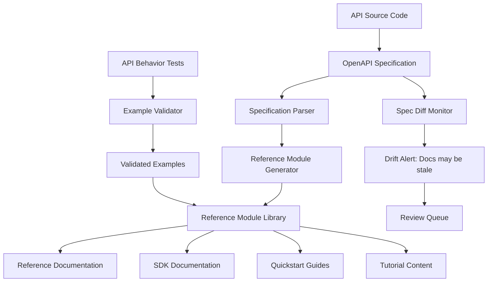

# Chapter 10: API and SDK Documentation Systems

## Learning Objectives

By the end of this chapter, you will be able to:

- Design a documentation system architecture that stays synchronized with API and SDK source code
- Implement automated reference documentation generation from OpenAPI specifications
- Build a tutorial and quickstart system that is tested against live API behavior
- Apply the content module model to technical reference documentation
- Maintain version-specific documentation across concurrent API versions

---

## Why API Documentation Is Different

API and SDK documentation occupies a unique position in technical content: it describes a machine-readable contract. Every claim in API documentation is verifiable by running code. When documentation says "this endpoint returns a 201 status on success," a test can confirm or contradict that claim within seconds.

This verifiability is both an opportunity and an obligation. The opportunity: documentation quality can be validated automatically, at a level of precision impossible in conceptual or procedural content. The obligation: incorrect API documentation is immediately discovered by every developer who reads it and writes code against it. The credibility cost of wrong API docs exceeds almost any other documentation failure.

The structural challenge of API documentation is synchronization. API behavior is defined in code. Documentation describes that behavior in English. When the code changes, documentation does not change automatically — unless the system is designed to make synchronization happen.

---

## The Reference Documentation Architecture

API reference documentation has a clear source of truth: the API specification. For REST APIs, this is typically an OpenAPI (formerly Swagger) specification. For GraphQL APIs, a schema. For gRPC, Protocol Buffer definitions. For SDKs, annotated source code.

The documentation system treats these specifications as the authoritative knowledge graph for API content. Reference documentation is derived from the spec; the spec is not derived from documentation.



The specification parser converts the API spec into structured module data. The reference module generator produces documentation modules from that structured data. The result is API reference documentation that is, by construction, synchronized with the spec.

---

## Generating Reference Documentation from OpenAPI

An OpenAPI specification contains all the information needed to generate complete reference documentation for each endpoint: path, method, description, parameters, request body schema, response schemas, and authentication requirements.

A reference module generator processes each endpoint definition and produces a structured reference module:

```python
import yaml
from anthropic import Anthropic

client = Anthropic()

def generate_endpoint_module(endpoint_spec: dict, style_guide: str) -> dict:
    """
    Generate a reference documentation module for an API endpoint.
    """
    prompt = f"""
    Generate API reference documentation for this endpoint.

    ENDPOINT SPECIFICATION:
    {yaml.dump(endpoint_spec, default_flow_style=False)}

    STYLE GUIDE:
    {style_guide}

    Generate documentation with these sections:
    1. Endpoint description (1-2 sentences from the spec description)
    2. Authentication (required auth method, how to provide it)
    3. Path and query parameters (table: name, type, required, description)
    4. Request body (if applicable: content type, schema with field descriptions)
    5. Response codes (table: code, description, when it occurs)
    6. Response body (schema with field descriptions)
    7. Example request (in HTTP format)
    8. Example response (realistic JSON)

    Rules:
    - Only include information present in the specification
    - Use the exact parameter names from the spec
    - Write [spec field empty — technical writer review required] for empty spec fields
    - Format as markdown
    """

    response = client.messages.create(
        model="claude-opus-4-6",
        max_tokens=3000,
        messages=[{"role": "user", "content": prompt}]
    )

    return {
        "module_id": f"api-ref-{endpoint_spec['operationId']}",
        "module_type": "reference",
        "endpoint_path": endpoint_spec["path"],
        "endpoint_method": endpoint_spec["method"],
        "body": response.content[0].text,
        "source_reference": f"OpenAPI spec v{endpoint_spec['api_version']}, {endpoint_spec['path']}",
        "generated_from_spec": True,
        "spec_hash": compute_spec_hash(endpoint_spec)
    }
```

The `spec_hash` field enables drift detection: when the spec changes, any reference module whose `spec_hash` no longer matches the current spec is flagged for regeneration.

---

## Keeping Examples Accurate: Tested Documentation

The most common failure in API documentation is inaccurate examples. An example that does not run against the actual API is worse than no example — it sends developers down a debugging path that ends in discovering the docs are wrong, not their code.

Tested documentation solves this by executing examples against a test environment and validating that the responses match what the documentation claims.

```python
import requests
import json

def validate_example(example: dict, api_base_url: str, api_key: str) -> dict:
    """
    Execute a documented API example and validate the response matches the documentation.
    """
    method = example["request"]["method"].lower()
    path = example["request"]["path"]
    headers = {
        "Authorization": f"Bearer {api_key}",
        "Content-Type": "application/json"
    }
    body = example["request"].get("body")

    # Execute the request
    response = getattr(requests, method)(
        f"{api_base_url}{path}",
        headers=headers,
        json=body
    )

    # Validate response code
    expected_code = example["expected_response"]["status_code"]
    actual_code = response.status_code

    # Validate response schema (not exact values — schema shape)
    schema_match = validate_response_schema(
        response.json(),
        example["expected_response"]["schema"]
    )

    return {
        "example_id": example["id"],
        "status_code_match": actual_code == expected_code,
        "actual_status_code": actual_code,
        "schema_match": schema_match,
        "validation_timestamp": datetime.now().isoformat(),
        "passed": actual_code == expected_code and schema_match
    }
```

Run example validation:
- On every API release, against the new version
- Nightly, against the current production API
- As part of the documentation PR review for any example change

Failed validations are high-severity drift alerts: the API behavior changed and the documented example is now wrong.

---

## Tutorial and Quickstart Architecture

Reference documentation tells developers what an API can do. Tutorials and quickstarts show them how to use it to accomplish something useful. These two content types have different update patterns and different drift vectors.

Reference documentation drifts when API behavior changes. Tutorials drift when reference documentation changes (a procedure that was correct in v1 may not compile against v2), and also when developer tooling changes (a Node.js tutorial written for Node 16 may have syntax issues in Node 22).

The tutorial architecture:

```
tutorials/
├── quickstarts/
│   ├── quickstart-first-api-call/
│   │   ├── quickstart.md               # Tutorial content
│   │   ├── complete-example.js         # Complete working code
│   │   ├── test-quickstart.js          # Automated test that runs the code
│   │   └── metadata.yaml               # Tutorial metadata
│   └── quickstart-oauth-setup/
├── how-to/
│   └── (task-focused tutorials)
└── guides/
    └── (conceptual guides)
```

Each tutorial has a companion test that validates the complete code example against the live API. Tutorial tests run in CI/CD on every API release. A failing tutorial test blocks the release notes from being published as "breaking change-free" — because the tutorial is now broken.

**Tutorial module metadata:**

```yaml
tutorial_id: quickstart-first-api-call
title: "Make Your First API Call"
audience: integration-developer
api_version_tested: "3.2"
runtime_tested: "Node.js 20.x"
dependencies:
  - axios: "^1.6.0"
estimated_time: "15 minutes"
tested_against:
  environment: staging
  last_passed: "2025-11-14"
  test_file: test-quickstart.js
concepts_demonstrated:
  - concept-api-authentication
  - concept-rate-limiting-api
```

When `api_version_tested` falls behind the current API version, the tutorial is automatically flagged for re-testing.

---

## Multi-Version Documentation

APIs support multiple versions concurrently: the current version, the previous version (still in use by existing integrations), and sometimes a beta version. Each version needs accurate documentation.

Multi-version documentation creates two structural requirements:

**Version-specific content routing** — A developer using API v2 should only see documentation for v2 endpoints and behaviors. They should not encounter v3 information that does not apply to their integration.

**Change delta documentation** — When a developer upgrades from v2 to v3, they need clear documentation of what changed. This is the migration guide: the set of differences between versions, organized by change type.

**Version management in the module system:**

```yaml
# Version metadata on reference modules
module_id: api-ref-create-resource
api_versions:
  v2:
    status: stable
    spec_section: "API Reference v2, /resources POST"
    spec_hash: "sha256:abc123..."
  v3:
    status: stable
    spec_section: "API Reference v3, /resources POST"
    spec_hash: "sha256:def456..."
    changes_from_v2:
      - "Added `metadata` field to request body (optional)"
      - "Response now includes `created_by` field"
```

**Migration guide generation:**

Migration guides are a special content type that compares modules across versions and generates human-readable change documentation.

```python
def generate_migration_guide(
    from_version: str,
    to_version: str,
    module_registry: list
) -> str:
    """
    Generate migration documentation from one API version to another.
    """
    changed_modules = [
        m for m in module_registry
        if from_version in m.get("api_versions", {}) and
           to_version in m.get("api_versions", {}) and
           m["api_versions"][from_version]["spec_hash"] !=
           m["api_versions"][to_version]["spec_hash"]
    ]

    # Group by change type for organized documentation
    breaking_changes = [m for m in changed_modules if m.get("is_breaking_change")]
    additive_changes = [m for m in changed_modules if not m.get("is_breaking_change")]

    prompt = f"""
    Generate a migration guide section for upgrading from API {from_version} to {to_version}.

    BREAKING CHANGES (require code updates):
    {yaml.dump([m['changes_from_previous'] for m in breaking_changes])}

    ADDITIVE CHANGES (no code updates required):
    {yaml.dump([m['changes_from_previous'] for m in additive_changes])}

    Format as a migration guide with:
    1. Executive summary (what changed and why)
    2. Breaking changes section with before/after code examples
    3. New capabilities section
    4. Recommended migration steps
    """

    # ... generate and return
```

---

## SDK Documentation Patterns

SDK documentation presents additional challenges beyond API reference documentation: it must be accurate across multiple programming languages, each with distinct conventions, and synchronized with SDK source code across multiple package repositories.

**Docstring-to-documentation pipeline:**

SDK documentation should be generated from source code docstrings, not maintained as separate documents. This ensures that documentation and implementation stay synchronized, because they live in the same file.

```python
# In the SDK source
def create_resource(
    name: str,
    resource_type: str,
    metadata: dict | None = None
) -> Resource:
    """
    Create a new resource in the platform.

    Args:
        name: Human-readable name for the resource. Must be unique within the account.
              Maximum 255 characters.
        resource_type: The type of resource. Valid values: "standard", "premium", "enterprise".
        metadata: Optional dictionary of custom key-value pairs. Maximum 50 keys.

    Returns:
        Resource: The created resource object with id, name, resource_type, created_at,
                  and metadata fields populated.

    Raises:
        AuthenticationError: If the API key is invalid or expired.
        ValidationError: If required fields are missing or values are invalid.
        RateLimitError: If the API rate limit has been exceeded.

    Example:
        >>> client = PlatformClient(api_key="your_api_key")
        >>> resource = client.create_resource(
        ...     name="Production Database",
        ...     resource_type="enterprise",
        ...     metadata={"team": "infrastructure", "cost_center": "eng-001"}
        ... )
        >>> print(resource.id)
        res_abc123xyz
    """
```

A docstring parser extracts this structured content and generates reference module YAML automatically. The parser runs as part of the SDK build process — documentation is always synchronized with the version of the code that was just built.

---

## The Developer Experience Feedback Loop

API and SDK documentation has a uniquely tight feedback loop: developers use documentation while writing code, and they know immediately if the documentation is wrong. Build this feedback signal into the documentation system.

**In-documentation feedback** — A "Was this helpful?" widget at the bottom of each reference page, with an option to specify what was missing or incorrect. These responses create a prioritized list of documentation improvement tasks.

**Error message to documentation linking** — When an API returns an error, the error response should include a link to the documentation that explains the error and how to resolve it. When these links are clicked frequently for a specific error, it indicates either that the error is common (product issue) or the documentation for it is unclear (content issue).

**SDK issue to documentation triage** — Issues filed in SDK repositories are a high-signal source of documentation gaps. A weekly triage of SDK issues labeled "documentation" or "unclear" feeds improvement tasks into the content operations queue.

---

## Key Takeaways

- API reference documentation is derived from the spec, not the other way around. The spec is the knowledge graph for API content.
- Automated generation from OpenAPI specifications ensures reference documentation structure matches the actual API contract.
- Tested documentation — executing examples against the live API and validating responses — is the only reliable way to catch example drift.
- Tutorial architecture includes companion tests that run against the live API; failing tutorial tests indicate that the tutorial is broken, not the developer's code.
- Multi-version documentation requires version-specific content routing, per-module version metadata, and automated migration guide generation.
- SDK documentation lives in source code docstrings and is generated at build time — synchronization happens because documentation and implementation are in the same file.
- Developer feedback loops (in-doc feedback, error message links, SDK issue triage) provide high-signal content improvement priorities that complement automated drift detection.

---

## System Integration: Completing the Architecture

This chapter completes the ten-component content architecture system. Each chapter's deliverable connects to the others:

| Component | Feeds Into |
|-----------|-----------|
| Knowledge graph (Ch. 1) | Module library, generation pipeline, drift detection |
| Module library (Ch. 2) | Generation, adaptation, QA, version control |
| AI generation (Ch. 3) | Module library population, variant generation |
| Multi-audience adaptation (Ch. 4) | Output publishing, variant drift detection |
| Quality assurance (Ch. 5) | Module approval workflow, coverage analysis |
| Drift detection (Ch. 6) | Review queue, variant regeneration |
| Metrics (Ch. 7) | Investment priorities, module effectiveness scores |
| Scaling operations (Ch. 8) | Team workflows, platform replication |
| Version control (Ch. 9) | All changes, audit trails, rollback |
| API documentation (Ch. 10) | Specialized reference generation, spec synchronization |

The complete system is a single source of truth that generates audience-specific content, validates quality automatically, detects drift before learners encounter it, measures effectiveness empirically, and maintains a full audit trail of every change. It scales because each component is automated where automation is appropriate and human-reviewed where judgment is required.

---

*This concludes the AI-Native Content Architecture program. The operational system you have designed across these ten chapters is ready for implementation.*
