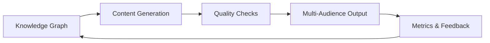

# AI-Native Content Architecture

## Building Single-Source Training Systems at Scale

---

## The Problem

Training content is one of the fastest-growing liabilities in any organization that ships software, onboards customers, or enables internal teams. The pattern is familiar:

- **Content sprawl** — the same concept explained differently across docs, slides, LMS modules, and onboarding guides
- **Silent drift** — product ships a new feature, but 14 training artifacts still reference the old behavior
- **Audience mismatch** — a single doc serves engineers, sales, and customers, satisfying none of them
- **Manual maintenance** — content teams spend 70% of their time updating existing material instead of creating new value

These problems compound. At scale, manual content maintenance doesn't just slow down — it breaks entirely.

---

## What This System Does

AI-Native Content Architecture is a methodology for building training content systems where **a single source of truth generates audience-adapted content automatically**, with built-in quality assurance and drift detection.

The architecture follows three core stages:

### 1. Knowledge Graph Foundation

Every concept, procedure, and relationship lives in a structured knowledge graph — not scattered across documents. This graph is the single source of truth. When a product changes, you update one node, and every downstream artifact inherits the change.

### 2. AI-Augmented Content Generation

Modular content templates combined with LLM-powered generation produce audience-specific materials from the same underlying knowledge. An API reference, a customer tutorial, and a sales enablement deck can all trace back to the same source nodes.

### 3. Automated Quality Assurance

Continuous checks detect:

- **Content drift** — when documentation no longer matches the current product state
- **Coverage gaps** — concepts that exist in the knowledge graph but have no training material
- **Consistency violations** — conflicting explanations across different content surfaces
- **Staleness signals** — content that hasn't been reviewed since the underlying source changed

---

## Who This Is For

| Role | What You'll Learn |
|------|-------------------|
| **Content Architects** | How to design knowledge graph-based content structures that scale |
| **Training Program Managers** | How to reduce content maintenance burden by 60-80% |
| **Enablement Leaders** | How to serve multiple audiences from a single content investment |
| **Developer Education Teams** | How to keep API docs, tutorials, and guides synchronized automatically |

---

## How to Navigate This System

- **[Course Description](course-description.md)** — full scope, prerequisites, learning outcomes, and chapter overview
- **[Chapters](chapters/index.md)** — deep dives into each component of the architecture

---

## Core Principles

!!! tip "Design Principle"
    Every piece of training content should trace back to a single authoritative source. If you can't trace it, you can't trust it.

1. **Single source of truth** — one knowledge graph, many outputs
2. **Audience-aware generation** — same concept, different depth and framing
3. **Continuous validation** — automated checks, not periodic audits
4. **Measurable outcomes** — every content decision backed by learner performance data
5. **Version-controlled content** — full history, diffs, and rollback capability

---

*This project demonstrates a production-ready approach to AI-native content architecture — the methodology behind training systems that scale with the product, not against it.*
